# Learning Guide: Core Code Layers for EnvelopeSend & Recipient Limits

> **Audience**: Engineers working on migrating envelope/recipient limits to MSF.  
> **Goal**: Understand every layer of the current Core rate-limiting code — from API entry point to enforcement.  
> **Print-friendly**: This document is designed to be printed and read offline.

---

## Table of Contents

1. [Part 1 – Big Picture: Two Entry Paths](#part-1--big-picture-two-entry-paths)
2. [Part 2 – The Three Limit Types](#part-2--the-three-limit-types)
3. [Part 3 – REST API Path (Detailed)](#part-3--rest-api-path-detailed)
   - [APILimitsTracker → APICallLimitHandler](#31-apilimitstracker--apicalllimithandler)
   - [ThrottleAndTrack: The Orchestrator](#32-throttleandtrack-the-orchestrator)
   - [IThrottleFactory & ServiceCallType](#33-ithrottlefactory--servicecalltype)
4. [Part 4 – Signing Path (Detailed)](#part-4--signing-path-detailed)
5. [Part 5 – CumulativeRecipientLimitsV2 Deep Dive](#part-5--cumulativerecipientlimitsv2-deep-dive)
   - [The Three-Phase Model](#51-the-three-phase-model)
   - [Phase 1: GetProtectors (Initialization)](#52-phase-1-getprotectors-initialization)
   - [Phase 2: UpdateCount (Tracking)](#53-phase-2-updatecount-tracking)
   - [Phase 3: CheckAndThrowIfThrottled (Enforcement)](#54-phase-3-checkandthrowifthrottled-enforcement)
   - [The Context Object Pattern](#55-the-context-object-pattern)
6. [Part 6 – Configuration Sources (The Three-Headed Beast)](#part-6--configuration-sources-the-three-headed-beast)
   - [Source 1: DSS (Dynamic System Settings)](#61-source-1-dss-dynamic-system-settings)
   - [Source 2: ServiceLimitDefaults](#62-source-2-servicelimitdefaults)
   - [Source 3: Account Admin Service Limits](#63-source-3-account-admin-service-limits)
   - [How They Interact](#64-how-they-interact)
7. [Part 7 – Business Logic Layers](#part-7--business-logic-layers)
   - [SecOps Trust Multiplier](#71-secops-trust-multiplier)
   - [Account Age Segmentation](#72-account-age-segmentation)
   - [Signing Group Expansion](#73-signing-group-expansion)
   - [RowLimit Mode (Disabled / Learning / Enabled)](#74-rowlimit-mode)
8. [Part 8 – V1 vs V2 Architecture](#part-8--v1-vs-v2-architecture)
9. [Part 9 – Counter Storage (Sauce)](#part-9--counter-storage-sauce)
10. [Part 10 – File Map: Where Everything Lives](#part-10--file-map-where-everything-lives)
11. [Part 11 – What Changes When We Migrate to MSF](#part-11--what-changes-when-we-migrate-to-msf)
12. [Appendix A – DSS Configuration Details](#appendix-a--dss-configuration-details)
13. [Appendix B – ServiceLimitDefaults Values](#appendix-b--servicelimitdefaults-values)
14. [Appendix C – Key Kusto Queries](#appendix-c--key-kusto-queries)

---

## Part 1 – Big Picture: Two Entry Paths

All envelope/recipient rate limiting in Core enters through one of **two paths**: the REST API path or the Signing path. Both converge on the same underlying enforcement logic.

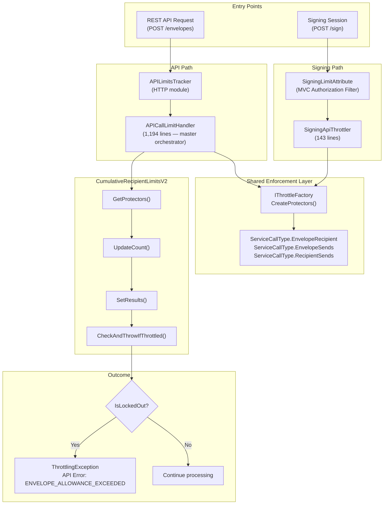

**Key insight**: `APICallLimitHandler` is the massive orchestrator (1,194 lines) that coordinates ALL rate-limiting logic for the REST API path. It handles not just recipient/envelope limits, but also API call-rate limits, burst limits, and more. Our focus is on the `CumulativeRecipientLimitsV2` and `EnvelopeSends` portions.

---

## Part 2 – The Three Limit Types

There are three distinct limit types that we're targeting for MSF migration. They are **NOT the same thing** despite similar names:

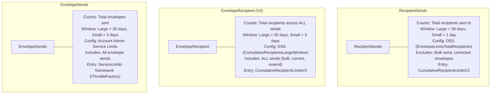

### Comparison Table

| Aspect | RecipientSends | EnvelopeRecipient (V2) | EnvelopeSends |
|--------|---------------|----------------------|---------------|
| **What it counts** | Recipients sent to | Recipients across all sends | Envelopes sent |
| **Bulk sends** | ❌ Excluded | ✅ Included | ✅ Included |
| **Corrected envelopes** | ❌ Excluded | ✅ Included | ✅ Included |
| **Config source** | DSS (`EnvelopeLimitsTotalRecipients`) | DSS (`CumulativeRecipientsLargeWindow`) | Account Admin Service Limits |
| **Large window** | 30 days | 30 days | 30 days |
| **Small window** | 1 day | 3 days | 3 days |
| **Default limit (paid, >30d)** | 5,000 | 1,000 | Varies by plan |
| **Code entry** | `CumulativeRecipientLimitsV2` | `CumulativeRecipientLimitsV2` | `IThrottleFactory` |

**Our initial MSF scope**: `recipientSends` and `envelopeSends`. The `EnvelopeRecipient` limit also flows through `CumulativeRecipientLimitsV2` but uses `ServiceCallType.EnvelopeRecipient` via `IThrottleFactory`.

---

## Part 3 – REST API Path (Detailed)

### 3.1 APILimitsTracker → APICallLimitHandler

When a REST API request arrives (e.g., `POST /v2.1/accounts/{accountId}/envelopes`), it flows through:

```mermaid
sequenceDiagram
    participant Client as API Client
    participant Pipeline as ASP.NET Pipeline
    participant ALT as APILimitsTracker<br/>(HTTP Module)
    participant ACLH as APICallLimitHandler<br/>(1,194 lines)
    participant CRLv2 as CumulativeRecipientLimitsV2<br/>(Singleton)
    participant TF as IThrottleFactory
    participant Sauce as Sauce<br/>(NoSQL Counters)

    Client->>Pipeline: POST /envelopes
    Pipeline->>ALT: OnBeginRequest
    ALT->>ACLH: HandleRequest()

    Note over ACLH: Phase 1: Initialization
    ACLH->>CRLv2: GetProtectors(accountModule)
    CRLv2->>CRLv2: Read DSS limits<br/>Apply SecOps multiplier
    CRLv2-->>ACLH: IServiceCounter[]

    Note over ACLH: ... Request processes ...<br/>Recipients are added/sent

    ACLH->>CRLv2: UpdateCount(recipientData)
    Note over CRLv2: Counts rows with<br/>Status changed to "Sent"

    Note over ACLH: Phase 2: Track & Evaluate
    ACLH->>TF: ThrottleAndTrack()
    TF->>Sauce: Increment counters<br/>Read current values
    Sauce-->>TF: Counter values
    TF-->>ACLH: EvaluationResults

    ACLH->>CRLv2: SetResults(protectors, evaluationResults)
    Note over CRLv2: Determines IsLockedOut<br/>based on RowLimitMode

    Note over ACLH: Phase 3: Enforcement
    ACLH->>CRLv2: CheckAndThrowIfThrottled()
    CRLv2-->>ACLH: ThrottlingException (if over limit)
    ACLH-->>Client: 400 ENVELOPE_ALLOWANCE_EXCEEDED
```

#### APILimitsTracker

- **Role**: HTTP module that intercepts every REST API request
- **What it does**: Creates an `APICallLimitHandler` instance and delegates to it
- **Location**: Early in the ASP.NET pipeline

#### APICallLimitHandler (The Beast)

- **Size**: 1,194 lines — the single largest rate-limiting file
- **Role**: Master orchestrator for ALL rate limiting (not just recipients)
- **Handles**:
  - API call-rate limits (per minute/hour)
  - Burst limits
  - Cumulative recipient limits (via `CumulativeRecipientLimitsV2`)
  - Envelope send limits (via `IThrottleFactory`)
  - Custom account overrides

### 3.2 ThrottleAndTrack: The Orchestrator

`ThrottleAndTrack` is a critical method inside `APICallLimitHandler` that coordinates counter updates:

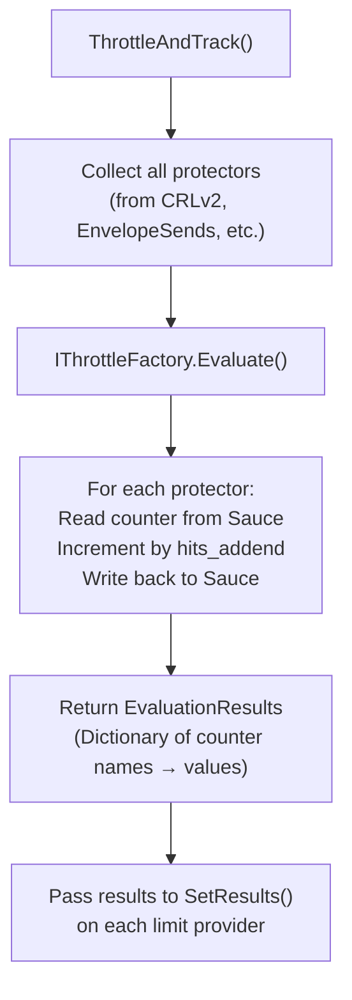

### 3.3 IThrottleFactory & ServiceCallType

`IThrottleFactory` is the abstraction that creates "protectors" — objects that know how to check/increment a specific counter.

```csharp
// Simplified interface
public interface IThrottleFactory
{
    IEnumerable<IServiceCounter> CreateProtectors(
        ServiceCallType callType,        // What kind of limit
        ThrottlingKeyType keyType,       // What entity to limit (AccountId, UserId)
        string keyValue                  // The actual ID
    );
}
```

**ServiceCallType** values relevant to us:

| ServiceCallType | What it limits | Used by |
|----------------|---------------|---------|
| `EnvelopeRecipient` | Cumulative recipients (V2) | `CumulativeRecipientLimitsV2.GetProtectors()` |
| `EnvelopeSends` | Envelopes sent | `APICallLimitHandler` directly |
| `RecipientSends` | Recipients sent (excludes bulk/correct) | `CumulativeRecipientLimitsV2` (alternate path) |

Each `ServiceCallType` maps to a row in `ServiceLimitDefaults` which provides fallback limits when no Account Admin override exists.

---

## Part 4 – Signing Path (Detailed)

The Signing path is used when envelopes are sent from the signing ceremony (e.g., an in-person signing session or a signing redirect).

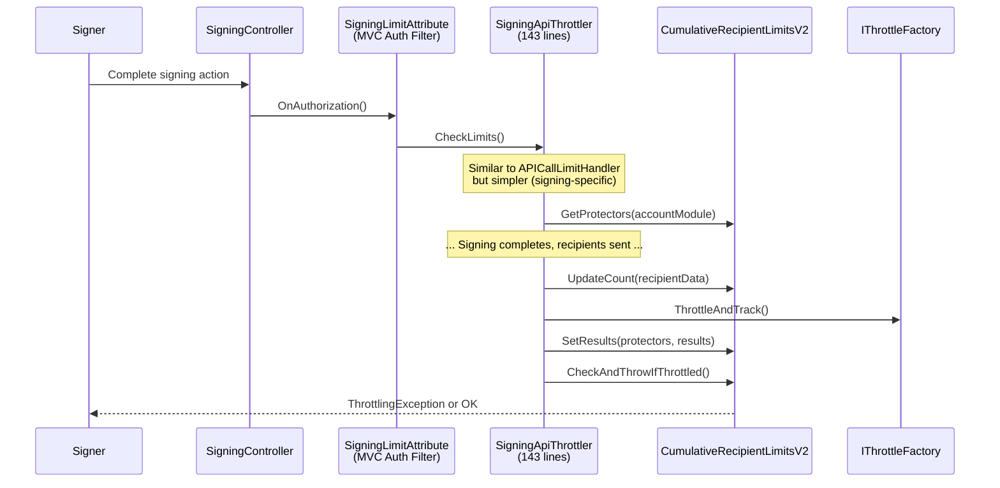

**Key differences from REST API path:**

| Aspect | REST API Path | Signing Path |
|--------|--------------|--------------|
| **Entry** | `APILimitsTracker` (HTTP module) | `SigningLimitAttribute` (MVC filter) |
| **Orchestrator** | `APICallLimitHandler` (1,194 lines) | `SigningApiThrottler` (143 lines) |
| **Complexity** | Handles ALL limit types | Only recipient/envelope limits |
| **When it runs** | Before response is sent | During signing authorization |

---

## Part 5 – CumulativeRecipientLimitsV2 Deep Dive

This is the **core class** you need to understand deeply. It implements a **deferred enforcement model** using three phases.

**File**: `Components/BusinessObjectsCore/RecipientLimits/RecipientLimits/CumulativeRecipientLimitsV2.cs` (326 lines)

### 5.1 The Three-Phase Model

Unlike a simple "check → allow/deny" model, V2 uses a **deferred** approach:

```mermaid
stateDiagram-v2
    [*] --> Phase1_Init: Request arrives

    state "Phase 1: Initialization" as Phase1_Init {
        [*] --> ReadDSS: Read DSS config<br/>(CumulativeRecipientsLargeWindow/<br/>CumulativeRecipientsSmallWindow)
        ReadDSS --> ParseRowLimit: Parse "5000,Enabled"<br/>into RowLimit object
        ParseRowLimit --> CheckSecOps: Is account Trusted<br/>SecOps status?
        CheckSecOps --> ApplyMultiplier: Yes → multiply by 3x
        CheckSecOps --> CreateProtectors: No → use as-is
        ApplyMultiplier --> CreateProtectors
        CreateProtectors --> StoreContext: Save to GlobalStorage<br/>(per-request context)
    }

    Phase1_Init --> Phase2_Track: Processing continues

    state "Phase 2: Tracking" as Phase2_Track {
        [*] --> ScanRecipients: Scan RecipientData DataSet
        ScanRecipients --> CountModified: Count rows:<br/>Status changed TO "Sent"
        CountModified --> CountAdded: Count rows:<br/>Newly added with "Sent"
        CountAdded --> CountCC: Count rows:<br/>Created → Completed (CC)
        CountCC --> AccumCount: UpdateCount += sum
    }

    Phase2_Track --> Phase3_Enforce: After Sauce counters updated

    state "Phase 3: Enforcement" as Phase3_Enforce {
        [*] --> CheckResults: Check each protector's<br/>IsLockedOut result
        CheckResults --> EvalMode: Only enforce if<br/>RowLimitMode == Enabled
        EvalMode --> Decision: Any protector locked out?
        Decision --> ThrowException: Yes → ThrottlingException
        Decision --> Allow: No → Continue
    }

    Phase3_Enforce --> [*]
```

**Why deferred?** Because the system needs to:
1. **Know the limits** before processing starts (Phase 1)
2. **Count recipients** as they are processed (Phase 2 — happens during the actual envelope creation)
3. **Decide** after all recipients are counted and Sauce counters are updated (Phase 3)

### 5.2 Phase 1: GetProtectors (Initialization)

```csharp
// CumulativeRecipientLimitsV2.cs — GetProtectors()
public IServiceCounter[] GetProtectors(IAccountModule accountModule)
{
    // 1. Validate input
    if (accountModule == null || accountModule.IsEmpty) return null;
    var accountId = accountModule.First.AccountId;
    if (accountId == Guid.Empty) return null;

    // 2. Set account age into DSS context (for segmentation)
    _accountPlanModuleHelper.SetAccountAgeToDssContext(accountModule.First);

    // 3. Read DSS limits
    RowLimit largeWindowRowLimit = GetLimitBasedOnAccountStatus(
        DynamicSystemSettings.CumulativeRecipientsLargeWindow, accountModule);
    RowLimit smallWindowRowLimit = GetLimitBasedOnAccountStatus(
        DynamicSystemSettings.CumulativeRecipientsSmallWindow, accountModule);

    // 4. Store context for later phases
    GlobalStorage.Current[GlobalStorageItem.CumulativeRecipientLimitContext] =
        new CumulativeRecipientLimitContext()
        {
            AccountId = accountId,
            LargeWindowRowLimitMode = largeWindowRowLimit.Mode,   // Enabled/Disabled/Learning
            LargeWindowRowLimitValue = largeWindowRowLimit.Value,  // e.g., 5000
            SmallWindowRowLimitMode = smallWindowRowLimit.Mode,
            SmallWindowRowLimitValue = smallWindowRowLimit.Value,
            UpdateCount = 0,    // Will be incremented in Phase 2
        };

    // 5. Create protectors from IThrottleFactory
    return GetProtectors(accountId, largeWindowRowLimit.Mode, ...);
}
```

**What `GetProtectors` (private) does internally:**

```csharp
private IServiceCounter[] GetProtectors(Guid accountId, ...)
{
    // Ask IThrottleFactory for EnvelopeRecipient protectors
    var foundProtectors = _throttleFactory.CreateProtectors(
        ServiceCallType.EnvelopeRecipient,
        ThrottlingKeyType.AccountId,
        accountId.ToString());

    foreach (var protector in foundProtectors)
    {
        // If this is a DEFAULT protector (no override in Account Admin),
        // use the DSS limit instead of the ServiceLimitDefaults value
        var isDefault = protector.Options.LimitOverrideType == null;

        switch (protector.Options.WindowSize)
        {
            case ThrottleWindowSize.LargeWindow:
                protector.Options.LockoutThreshold = isDefault
                    ? largeWindowLimitValue  // From DSS
                    : protector.Options.LockoutThreshold; // From Account Admin
                break;
            case ThrottleWindowSize.SmallWindow:
                // Same pattern for small window
                break;
        }

        protector.Options.IncrementBy = incrementBy;
        protector.Options.EvaluateWithIncrementAmount = true;
        protector.Options.Action = ProtectorAction.Learn; // Always in Learn mode here
    }

    return enforcedProtectors.ToArray();
}
```

**Critical detail**: Notice `ProtectorAction.Learn` — the protector itself is set to "Learn" mode. The actual enforcement decision happens in Phase 3 based on `RowLimitMode`, NOT the protector's action. This is an important architectural distinction.

### 5.3 Phase 2: UpdateCount (Tracking)

This method is called during envelope processing as recipients are being saved to the database.

```csharp
// CumulativeRecipientLimitsV2.cs — UpdateCount()
public void UpdateCount(RecipientData dataSet)
{
    var context = GetCumulativeRecipientLimitContext();
    if (context == null) return;

    // Count recipients whose status changed TO "Sent"
    var modifiedRows = dataSet.Recipient.Where(row =>
        row.RowState == DataRowState.Modified &&
        row["Status", DataRowVersion.Current].ToString() == "Sent" &&
        row["Status", DataRowVersion.Original].ToString() != "Sent").ToList();

    // Count CC recipients (Created → Completed)
    var ccRows = dataSet.Recipient.Where(row =>
        row.RowState == DataRowState.Modified &&
        row["Status", DataRowVersion.Original].ToString() == "Created" &&
        row["Status", DataRowVersion.Current].ToString() == "Completed").ToList();

    // Count newly added recipients with "Sent" status
    int addedCount = dataSet.Recipient
        .Select("Status = 'Sent'", "", DataViewRowState.Added).Length;

    int newlySentCount = modifiedRows.Count + addedCount + ccRows.Count;

    if (newlySentCount > 0)
    {
        context.UpdateCount += newlySentCount;  // Accumulate!
    }
}
```

**Where is UpdateCount called?** From `RecipientAccessSql.cs` at line ~762, during the actual database save of recipient records.

### 5.4 Phase 3: CheckAndThrowIfThrottled (Enforcement)

```csharp
// CumulativeRecipientLimitsV2.cs — CheckAndThrowIfThrottled()
public void CheckAndThrowIfThrottled()
{
    var context = GetCumulativeRecipientLimitContext();

    if (context?.IsLockedOut == true)
    {
        throw new ThrottlingException(
            APIError.Errors.Recipient_Limit_Exceeded,
            "The cumulative recipient limit has been exceeded.",
            context.Protectors,
            context.EvaluationResults);
    }
}
```

**Where is CheckAndThrowIfThrottled called?**
- `EnvelopeModule` at line ~5202
- `RecipientModule` at line ~6037

**And how does `IsLockedOut` get set?** In `SetResults()`:

```csharp
public void SetResults(IServiceCounter[] protectors,
    IReadOnlyDictionary<string, long> evaluationResults)
{
    var isLockedOut = protectors
        .Where(p => p?.Options?.WindowSize == ThrottleWindowSize.LargeWindow
            ? context.LargeWindowRowLimitMode == RowLimitMode.Enabled  // ← KEY!
            : context.SmallWindowRowLimitMode == RowLimitMode.Enabled)
        .Select(p => p?.IsLockedOut(evaluationResults))
        .Any(r => r?.IsLockedOut == true);

    context.IsLockedOut = isLockedOut;
}
```

**Key insight**: Even if a protector says `IsLockedOut = true`, enforcement only happens if `RowLimitMode == Enabled`. If the mode is `Learning`, the counter is tracked but NOT enforced. This gives us a safe way to roll out new limits.

### 5.5 The Context Object Pattern

`CumulativeRecipientLimitsV2` is a **Singleton** (registered once, reused across requests). So how does it store per-request state?

**Answer**: `GlobalStorage.Current` — a per-request dictionary (similar to `HttpContext.Items`).

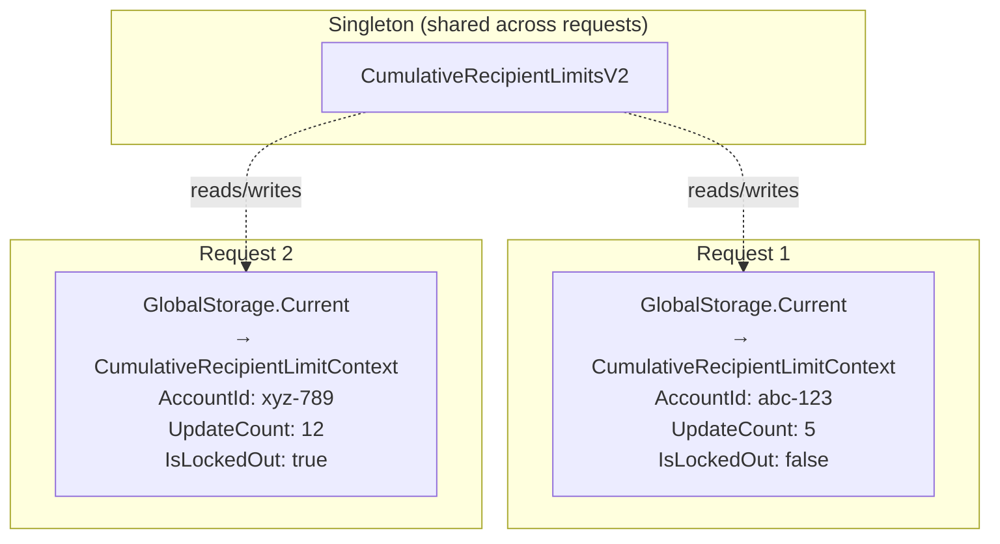

The `CumulativeRecipientLimitContext` is an internal class:

```csharp
internal class CumulativeRecipientLimitContext
{
    public Guid AccountId { get; set; }
    public RowLimitMode LargeWindowRowLimitMode { get; set; }  // Disabled/Learning/Enabled
    public int LargeWindowRowLimitValue { get; set; }           // e.g., 5000
    public RowLimitMode SmallWindowRowLimitMode { get; set; }
    public int SmallWindowRowLimitValue { get; set; }
    public IServiceCounter[] Protectors { get; set; }
    public bool IsLockedOut { get; set; }
    public IReadOnlyDictionary<string, long> EvaluationResults { get; set; }
    public int UpdateCount { get; set; }                        // Accumulated count
}
```

---

## Part 6 – Configuration Sources (The Three-Headed Beast)

This is one of the most confusing aspects of the current system. Limits come from **three different sources**, and they interact in non-obvious ways.

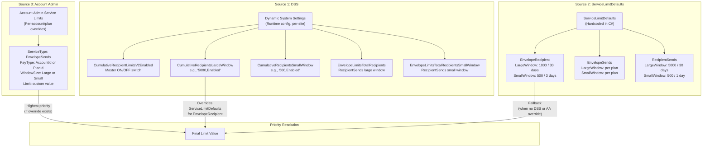

### 6.1 Source 1: DSS (Dynamic System Settings)

DSS is Docusign's **runtime configuration system**. Limits stored in DSS can be changed without code deployment, per-site, with segmentation.

#### Master Switches

| DSS Key | Purpose | Value |
|---------|---------|-------|
| `CumulativeRecipientLimitsV2Enabled` | Turn V2 on/off globally | `true` / `false` |
| `EnableEnvelopeLimitIncreaseForTrustedAccount` | Enable SecOps 3x multiplier | `true` / `false` |

#### EnvelopeRecipient Limits (V2)

| DSS Key | Purpose | Example Value |
|---------|---------|---------------|
| `CumulativeRecipientsLargeWindow` | 30-day limit with mode | `"1000,Enabled"` |
| `CumulativeRecipientsSmallWindow` | 3-day limit with mode | `"500,Enabled"` |

The value format is: `"<limit>,<mode>"` where mode is `Enabled`, `Disabled`, or `Learning`.

These DSS keys support **segmentation** by `AccountAge` using regex:

| Segment | Regex | Matches |
|---------|-------|---------|
| LessThan7Days | `\b([0-6])\b` | Ages 0-6 (< 7 days old) |
| LessThan30Days | `\b([0-9]\|[1-2][0-9])\b` | Ages 0-29 (< 30 days) |
| 30DaysAndMore | *(no regex — default)* | Age 30+ |

#### RecipientSends Limits

| DSS Key | Purpose | Example Value |
|---------|---------|---------------|
| `EnvelopeLimitsTotalRecipients` | 30-day limit for RecipientSends | `"5000,Enabled"` |
| `EnvelopeLimitsTotalRecipientsSmallWindow` | 1-day limit | `"500"` |

These DSS keys support **segmentation** by both `PlanName` and `AccountAge`:

| Segment | PlanName Condition | AccountAge | Limit |
|---------|-------------------|------------|-------|
| `7DaysFree` | `free\|trial\|chrome\|docusignit` (regex) | `\b([0-6])\b` | 10 |
| `OlderThan7DaysFree` | `free\|trial\|chrome\|docusignit` | *(default)* | 50 |
| `7DaysPaid` | *(other plans by PlanId)* | `\b([0-6])\b` | 250 |
| `30DaysPaid` | *(other plans by PlanId)* | `\b([0-9]\|[1-2][0-9])\b` | 500 |
| Default | *(all others)* | *(all)* | 5,000 |

### 6.2 Source 2: ServiceLimitDefaults

Hardcoded fallback limits defined in C# code. These provide a baseline when no DSS or Account Admin override exists.

**File**: `ServiceLimitDefaults.cs`

```csharp
// Simplified representation
public static class ServiceLimitDefaults
{
    // EnvelopeRecipient defaults
    EnvelopeRecipient_LargeWindow = 1000,  // 30-day window
    EnvelopeRecipient_SmallWindow = 500,   // 3-day window

    // EnvelopeSends defaults
    EnvelopeSends_LargeWindow = /* varies by plan */,
    EnvelopeSends_SmallWindow = /* varies by plan */,

    // RecipientSends defaults
    RecipientSends_LargeWindow = 5000,     // 30-day window
    RecipientSends_SmallWindow = 500,      // 1-day window
}
```

These values are used by `IThrottleFactory.CreateProtectors()` when creating protectors. The `protector.Options.LockoutThreshold` defaults to these values.

### 6.3 Source 3: Account Admin Service Limits

Per-account or per-plan overrides configured through the Account Admin UI. These are stored in a database and accessed via the `IThrottleFactory`.

**Configuration fields:**

| Field | Description | Example |
|-------|-------------|---------|
| ServiceType | Type of limit | `EnvelopeSends` |
| KeyType | What to key on | `AccountId` or `PlanId` |
| WindowSize | Time window | `LargeWindow` or `SmallWindow` |
| Identifier | The actual ID | GUID of account or plan |
| Limit | Max allowed | `30` |
| CRInitiator | Change ticket | `IM-39965` |

**Adding limits**: Done through Account Admin UI (lower environments) or via TECHOPS CR-401 ticket (DEMO/PROD).

**JSON format for bulk upload:**

```json
[
    {
        "ServiceType": "EnvelopeSends",
        "KeyType": "PlanId",
        "WindowSize": "LargeWindow",
        "Identifier": "112f0f2c-eee5-4c1e-abeb-a369ea1601d5",
        "Limit": 30,
        "CRInitiator": "IM-39965",
        "ReasonCode": "None",
        "StartDate": "0001-01-01T00:00:00Z",
        "EndDate": "0001-01-01T00:00:00Z",
        "RecurringAnnually": false
    }
]
```

### 6.4 How They Interact

The precedence and interaction is different for each limit type:

```mermaid
flowchart TD
    subgraph "EnvelopeRecipient (V2)"
        A1["IThrottleFactory.CreateProtectors<br/>(ServiceCallType.EnvelopeRecipient)"]
        A2{Account Admin<br/>override exists?}
        A3[Use Account Admin limit]
        A4[Use ServiceLimitDefaults<br/>as base]
        A5{DSS value available?}
        A6["Override with DSS value<br/>(CumulativeRecipientsLargeWindow)"]
        A7[Use ServiceLimitDefaults]

        A1 --> A2
        A2 -->|Yes| A3
        A2 -->|No| A4
        A4 --> A5
        A5 -->|Yes| A6
        A5 -->|No| A7
    end

    subgraph "EnvelopeSends"
        B1["IThrottleFactory.CreateProtectors<br/>(ServiceCallType.EnvelopeSends)"]
        B2{Account Admin<br/>override exists?}
        B3[Use Account Admin limit]
        B4[Use ServiceLimitDefaults]

        B1 --> B2
        B2 -->|Yes| B3
        B2 -->|No| B4
    end

    subgraph "RecipientSends"
        C1["Read DSS directly<br/>(EnvelopeLimitsTotalRecipients)"]
        C2["DSS segmentation resolves<br/>limit by PlanName + AccountAge"]
        C3[Final limit value]

        C1 --> C2
        C2 --> C3
    end
```

**The key interaction in CumulativeRecipientLimitsV2**:

```csharp
// In GetProtectors (private):
var isDefault = protector.Options.LimitOverrideType == null;

protector.Options.LockoutThreshold = isDefault
    ? largeWindowLimitValue    // DSS value overrides ServiceLimitDefaults
    : protector.Options.LockoutThreshold;  // Account Admin override stands
```

**Translation**: "If this protector uses the default limit (no Account Admin override), replace it with the DSS value. If there IS an Account Admin override, keep it."

---

## Part 7 – Business Logic Layers

These are the business rules that sit on top of the raw limit values. They **must remain in Core** even after MSF migration.

### 7.1 SecOps Trust Multiplier

Accounts marked as "Trusted" by SecOps get their limits multiplied.

```csharp
// CumulativeRecipientLimitsV2.cs — GetLimitBasedOnAccountStatus()
if (IsAccountTrustedSecOpsStatus(accountModule))
{
    currentLimit = new RowLimit(
        $"{DynamicSystemSettings.IncreaseTheLimitXTimesForTrustedAccount * currentLimit.Value},Enabled");
}
```

- **DSS**: `IncreaseTheLimitXTimesForTrustedAccount` (default: `3`)
- **DSS**: `EnableEnvelopeLimitIncreaseForTrustedAccount` (must be `true`)
- **Account setting**: `GeneralAccountSettings.SecOpsStatus == "Trusted"`

```
Normal account:  5,000 recipients / 30 days
Trusted account: 5,000 × 3 = 15,000 recipients / 30 days
```

### 7.2 Account Age Segmentation

The DSS uses the account's age (in days) to apply different limits for new vs. established accounts. This is an anti-fraud measure.

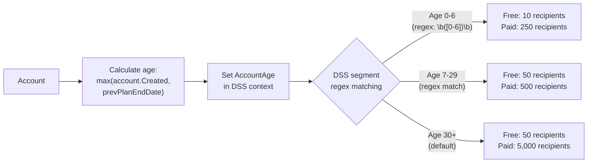

**The age calculation** is in `AccountPlanModuleHelper.SetAccountAgeToDssContext()`:

```csharp
// Pseudocode — actual implementation in AccountPlanModuleHelper.cs
DateTime accountStart = Max(account.Created, previousPlanEndDate);
int accountAge = (DateTime.UtcNow - accountStart).Days;
DssContext.Set("AccountAge", accountAge.ToString());
```

**Why `max(Created, prevPlanEndDate)`?** Because when an account switches plans, the "age" resets to prevent abuse via plan-switching.

### 7.3 Signing Group Expansion

When a signing group is added as a recipient, the system counts **each individual member** of the group, not the group as 1 recipient.

```
Signing Group "Legal Team" with 5 members
  → Counts as 5 recipient sends, NOT 1

This happens at the RecipientData level during UpdateCount:
  Each group member gets a separate row with Status = "Sent"
  So UpdateCount naturally counts them individually
```

### 7.4 RowLimit Mode

Each limit can be in one of three modes:

| Mode | Counter tracks? | Enforcement? | Use case |
|------|----------------|-------------|----------|
| `Disabled` | ❌ No | ❌ No | Limit turned off |
| `Learning` | ✅ Yes | ❌ No | Testing — log only |
| `Enabled` | ✅ Yes | ✅ Yes | Active enforcement |

The mode is parsed from the DSS value:

```
"5000,Enabled"   → Value=5000, Mode=Enabled
"5000,Learning"  → Value=5000, Mode=Learning
"5000,Disabled"  → Value=5000, Mode=Disabled
"5000"           → Value=5000, Mode=Enabled (default)
```

---

## Part 8 – V1 vs V2 Architecture

Understanding the V1 → V2 evolution helps explain why the current code is structured the way it is.

| Aspect | V1 (`CumulativeRecipientLimits`) | V2 (`CumulativeRecipientLimitsV2`) |
|--------|--------------------------------|-----------------------------------|
| **Lifetime** | Transient (new instance per request) | Singleton (shared, reused) |
| **State management** | Instance fields | `GlobalStorage.Current` (per-request) |
| **Enforcement timing** | Inline (during processing) | Deferred (after all counting done) |
| **File** | `CumulativeRecipientLimits.cs` (297 lines) | `CumulativeRecipientLimitsV2.cs` (326 lines) |
| **Interface** | `ICumulativeRecipientLimits` | `ICumulativeRecipientLimitsV2` |
| **Registration** | Unity, Transient | Unity, Singleton |
| **Status** | Legacy (still exists) | Current (production) |

**V2 Interface:**

```csharp
public interface ICumulativeRecipientLimitsV2 : ITrackingProtectorProvider
{
    bool IsInitialized();
    IServiceCounter[] GetProtectors(IAccountModule accountModule);
    void UpdateCount(RecipientData dataSet);
    void SetResults(IServiceCounter[] protectors,
        IReadOnlyDictionary<string, long> evaluationResults);
    void CheckAndThrowIfThrottled();
}
```

**DI Registration** (in `RecipientLimitsBootstrapper.cs`):

```csharp
// V2 — Singleton
container.RegisterType<ICumulativeRecipientLimitsV2, CumulativeRecipientLimitsV2>(
    new ContainerControlledLifetimeManager()); // ← Singleton!

// V1 — Transient (legacy)
container.RegisterType<ICumulativeRecipientLimits, CumulativeRecipientLimits>(
    new TransientLifetimeManager());
```

---

## Part 9 – Counter Storage (Sauce)

The current system stores counters in **Sauce** (Docusign's proprietary NoSQL store).

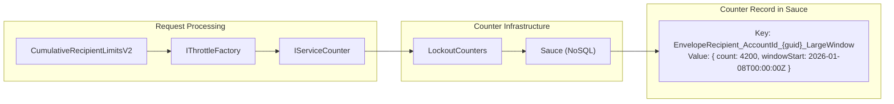

**How it works:**
1. `IThrottleFactory.CreateProtectors()` creates `IServiceCounter` objects
2. Each counter has a **Sauce key** derived from: `{ServiceCallType}_{KeyType}_{KeyValue}_{WindowSize}`
3. When `ThrottleAndTrack()` runs, it reads the counter from Sauce, increments by `UpdateCount`, and writes back
4. The counter's `windowStart` determines when the window resets

**Important for MSF migration**: MSF uses Redis instead of Sauce. The counter key format and storage mechanism will change. We need to handle the migration carefully (run both in parallel during transition).

---

## Part 10 – File Map: Where Everything Lives

### Core Implementation Files

| File | Path | Lines | Role |
|------|------|-------|------|
| `CumulativeRecipientLimitsV2.cs` | `Components/BusinessObjectsCore/RecipientLimits/RecipientLimits/` | 326 | Main V2 implementation |
| `ICumulativeRecipientLimitsV2.cs` | `...RecipientLimits.Abstractions/` | 25 | V2 interface |
| `CumulativeRecipientLimits.cs` | `...RecipientLimits/` | 297 | V1 legacy implementation |
| `ICumulativeRecipientLimits.cs` | `...RecipientLimits.Abstractions/` | — | V1 interface |
| `RecipientLimitsBootstrapper.cs` | `...RecipientLimits/` | — | Unity DI registration |
| `RecipientLimitUtil.cs` | `...RecipientLimits/` | — | Per-envelope max recipient count |

### Orchestration Layer

| File | Path | Lines | Role |
|------|------|-------|------|
| `APICallLimitHandler.cs` | `Components/BusinessObjects/` | 1,194 | Master REST API throttling orchestrator |
| `APILimitsTracker.cs` | `Components/BusinessObjects/` | — | REST API HTTP module entry point |
| `SigningApiThrottler.cs` | (Signing project) | 143 | Signing-specific throttler |
| `SigningLimitAttribute.cs` | (Signing project) | — | MVC authorization filter |

### Configuration & Infrastructure

| File | Path | Role |
|------|------|------|
| `ServiceLimitDefaults.cs` | (Platform) | Hardcoded fallback limits |
| `EnvelopeSendLimits.cs` | `Components/BusinessObjectsCore/ApiLimits/` | ServiceLimits-based envelope limits |
| `AccountPlanModuleHelper.cs` | (Components) | Account age calculation |

### Call Sites

| File | Line | Method Called |
|------|------|--------------|
| `RecipientAccessSql.cs` | ~762 | `UpdateCount()` |
| `EnvelopeModule.cs` | ~5202 | `CheckAndThrowIfThrottled()` |
| `RecipientModule.cs` | ~6037 | `CheckAndThrowIfThrottled()` |

### Project Structure

```
Components/BusinessObjectsCore/RecipientLimits/
├── RecipientLimits/                         ← Implementation
│   ├── CumulativeRecipientLimits.cs          (V1 - legacy)
│   ├── CumulativeRecipientLimitsV2.cs        (V2 - current)
│   ├── RecipientLimitsBootstrapper.cs        (DI registration)
│   └── RecipientLimitUtil.cs                 (per-envelope max)
├── RecipientLimits.Abstractions/            ← Interfaces
│   ├── ICumulativeRecipientLimits.cs         (V1 interface)
│   ├── ICumulativeRecipientLimitsV2.cs       (V2 interface)
│   └── IRecipientLimitUtil.cs
└── RecipientLimits.UnitTests/               ← Tests
```

---

## Part 11 – What Changes When We Migrate to MSF

### What Gets Replaced

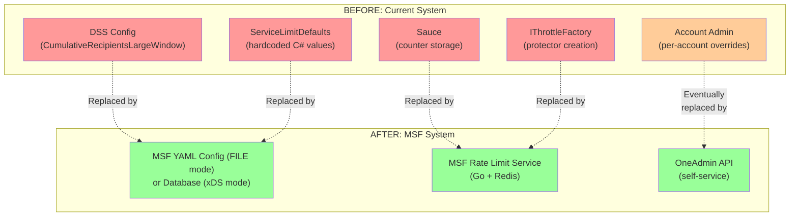

### What Stays (Business Logic)

| Logic | Why it stays | Where in code |
|-------|-------------|---------------|
| SecOps trust multiplier | Per-account trust status | `CumulativeRecipientLimitsV2.GetLimitBasedOnAccountStatus()` |
| Account age calculation | Complex date logic | `AccountPlanModuleHelper.SetAccountAgeToDssContext()` |
| Signing group expansion | Recipient counting logic | `UpdateCount()` method |
| RowLimit mode parsing | Control rollout behavior | `RowLimit` class |

### The Migration Path (Code Changes)

```mermaid
flowchart TD
    subgraph "Phase 1: Add MSF Shadow"
        P1A["Add NuGet:<br/>DocuSign.Protobuf.DocuSign.Ratelimit.V1"]
        P1B["Create MsfRateLimitClient<br/>(wraps gRPC calls)"]
        P1C["Inject into<br/>APICallLimitHandler"]
        P1D["After existing enforcement:<br/>Fire-and-forget MSF call<br/>(shadow mode)"]
        P1A --> P1B --> P1C --> P1D
    end

    subgraph "Phase 2: Dual Enforcement"
        P2A["MSF call BEFORE<br/>Sauce counter check"]
        P2B["Both systems enforce<br/>MSF = global safety net<br/>Core = per-account logic"]
        P2A --> P2B
    end

    subgraph "Phase 3: MSF Primary"
        P3A["MSF is primary enforcer"]
        P3B["Core logic moves to<br/>MSF descriptor enrichment"]
        P3C["Sauce counters deprecated"]
        P3A --> P3B --> P3C
    end
```

### Integration Point in Code

The most natural integration point is in `APICallLimitHandler`, within the `ThrottleAndTrack` flow:

```csharp
// Pseudocode: Where MSF gRPC call would be added
// In APICallLimitHandler.ThrottleAndTrack():

// EXISTING: Core enforcement
var protectors = _cumulativeRecipientLimitsV2.GetProtectors(accountModule);
// ... UpdateCount happens during processing ...
var results = _throttleFactory.Evaluate(protectors);
_cumulativeRecipientLimitsV2.SetResults(protectors, results);

// NEW: MSF enforcement (Phase 1 - shadow only)
var msfResponse = await _msfRateLimitClient.CheckLimitAsync(
    domain: "core-cumulative-recipients",
    descriptors: new[]
    {
        ("AccountId", accountId.ToString()),
        ("LimitType", "recipientSends"),
        ("WindowSize", "LargeWindow")
    },
    hitsAddend: recipientCount);

if (msfResponse.OverallCode == OverLimitCode)
{
    _logger.LogWarning("MSF shadow: would block account {AccountId}", accountId);
    // Phase 1: Log only. Phase 2+: Throw ThrottlingException
}
```

---

## Appendix A – DSS Configuration Details

### EnvelopeLimitsTotalRecipients (RecipientSends Large Window)

**Segments in production:**

| Segment Name | PlanName Condition | AccountAge Condition | Limit |
|-------------|-------------------|---------------------|-------|
| `7DaysFree` | `free\|trial\|chrome\|docusignit` | `\b([0-6])\b` | 10 |
| `OlderThan7DaysFree` | `free\|trial\|chrome\|docusignit` | *(default)* | 50 |
| `7DaysPaid` | By PlanId (DEMO) / By AccountAge (PROD) | `\b([0-6])\b` | 250 |
| `30DaysPaid` | By PlanId (DEMO) / By AccountAge (PROD) | `\b([0-9]\|[1-2][0-9])\b` | 500 |
| Default | *(all other accounts)* | *(all ages)* | 5,000 |

### JSON Template for Adding Custom Limits

```json
{
    "integrator": "core",
    "entity": "segments",
    "settings": [
        {
            "key": "EnvelopeLimitsTotalRecipients",
            "segments": [
                {
                    "name": "LessThan7Days-CustomPlan",
                    "description": "LessThan7Days-CustomPlan",
                    "value": "100,Enabled",
                    "isActive": true,
                    "sequence": 0,
                    "conditions": [
                        {
                            "value": "<PlanId-GUID>",
                            "context": "PlanId",
                            "operator": "In"
                        },
                        {
                            "value": "\\b([0-6])\\b",
                            "context": "AccountAge",
                            "operator": "RegExp"
                        }
                    ]
                }
            ]
        }
    ]
}
```

**Note**: Setting `sequence: 0` ensures the segment is evaluated FIRST, before default segments.

---

## Appendix B – ServiceLimitDefaults Values

| ServiceCallType | WindowSize | Default Limit | Window Duration |
|----------------|-----------|---------------|-----------------|
| `EnvelopeRecipient` | LargeWindow | 1,000 | 30 days |
| `EnvelopeRecipient` | SmallWindow | 500 | 3 days |
| `EnvelopeSends` | LargeWindow | Varies by plan | 30 days |
| `EnvelopeSends` | SmallWindow | Varies by plan | 3 days |
| `RecipientSends` | LargeWindow | 5,000 | 30 days |
| `RecipientSends` | SmallWindow | 500 | 1 day |

---

## Appendix C – Key Kusto Queries

### Verify RecipientSends DSS Values

```kql
GetDSSValuesAndSegments("EnvelopeLimitsTotalRecipients");
GetDSSValuesAndSegments("EnvelopeLimitsTotalRecipientsSmallWindow")
```

### Find Blocked EnvelopeSends

```kql
DSEvents
| where Timestamp > ago(1d)
| where Data has 'EnvelopeSends' and FullName has 'Platform.Web'
| extend
    PlanName = tostring(Data.DataPoints.PlanName),
    PlanId = tostring(Data.DataPoints.OriginalPlanId),
    LargeWindowLimit = toint(Data.ServiceProtection.EnvelopeSends.Keys.AccountId.LargeWindow.LockoutThreshold),
    LargeWindowCount = toint(Data.ServiceProtection.EnvelopeSends.Keys.AccountId.LargeWindow.Count),
    SmallWindowLimit = toint(Data.ServiceProtection.EnvelopeSends.Keys.AccountId.SmallWindow.LockoutThreshold),
    SmallWindowCount = toint(Data.ServiceProtection.EnvelopeSends.Keys.AccountId.SmallWindow.Count),
    EnvelopeSendsResult = tostring(Data.ServiceProtection.EnvelopeSends.Result),
    ErrorCode = tostring(Data.DataPoints.ApiErrorCode),
    AccountName = tostring(Data.DataPoints.ApiAccountName)
| where EnvelopeSendsResult has 'blocked'
| where LargeWindowCount > LargeWindowLimit or SmallWindowCount > SmallWindowLimit
| project Timestamp, Site, AccountName, PlanName, PlanId,
    LargeWindowCount, LargeWindowLimit, SmallWindowCount, SmallWindowLimit,
    EnvelopeSendsResult, ErrorCode, TraceToken
| top 100 by Timestamp
```

### Find Cumulative Recipient Limit Events

```kql
DSEvents
| where Timestamp > ago(1d)
| where Data has 'CumulativeRecipient'
| extend
    AccountId = tostring(Data.DataPoints.AccountId),
    UpdateCount = toint(Data.DataPoints.CumulativeRecipientUpdateCount),
    Result = tostring(Data.ServiceProtection.EnvelopeRecipient.Result)
| where Result has 'blocked'
| project Timestamp, Site, AccountId, UpdateCount, Result
| top 100 by Timestamp
```

---

*Document created: 2026-02-07*  
*Purpose: Self-study learning guide for Core rate-limiting code layers*
