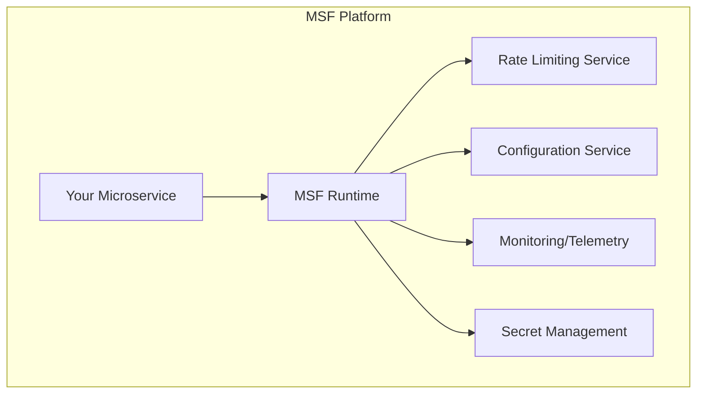
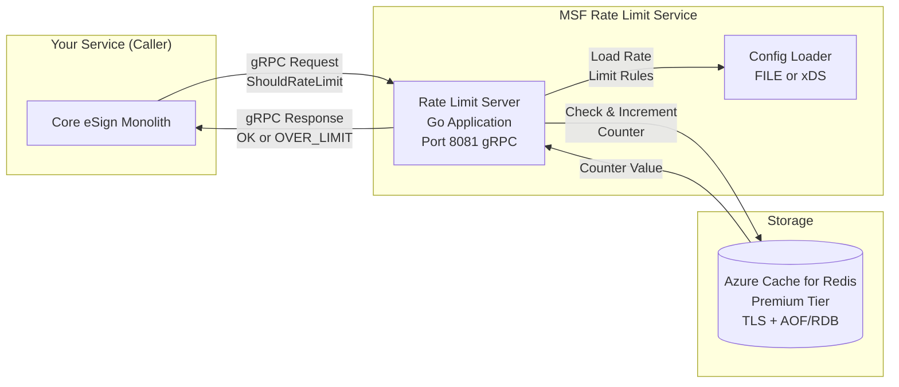
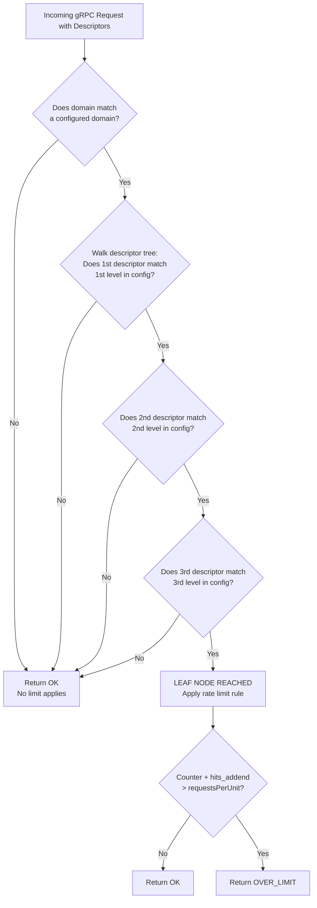
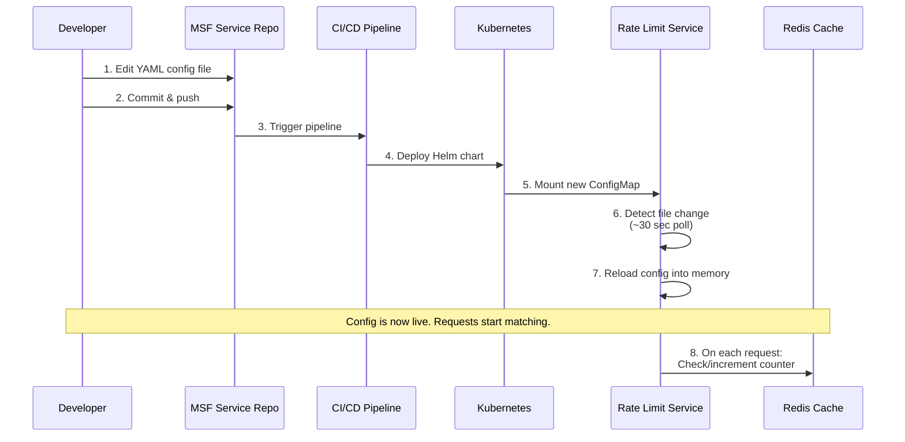
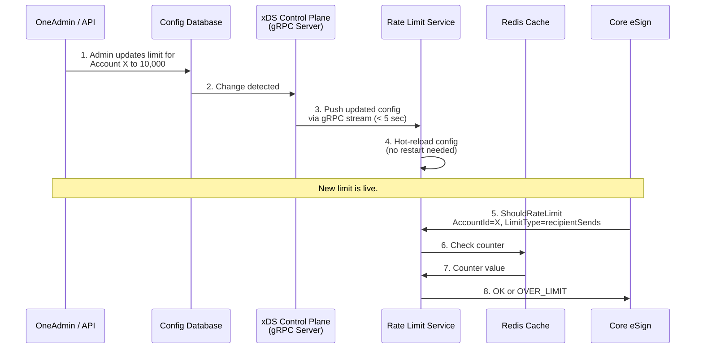
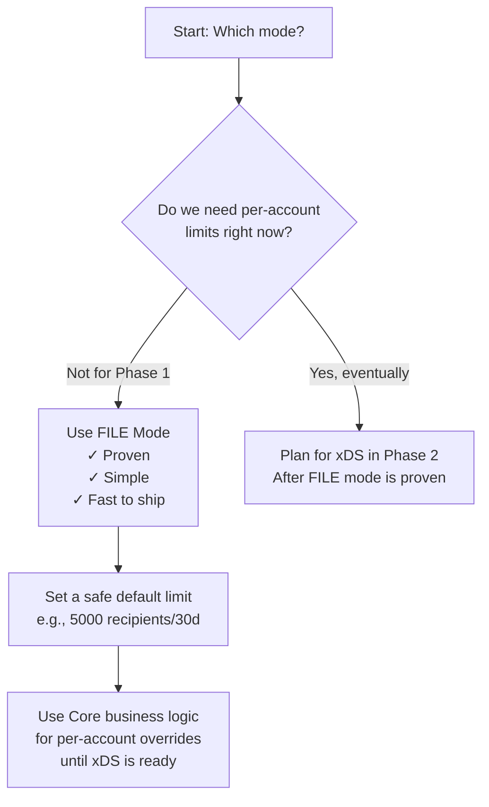
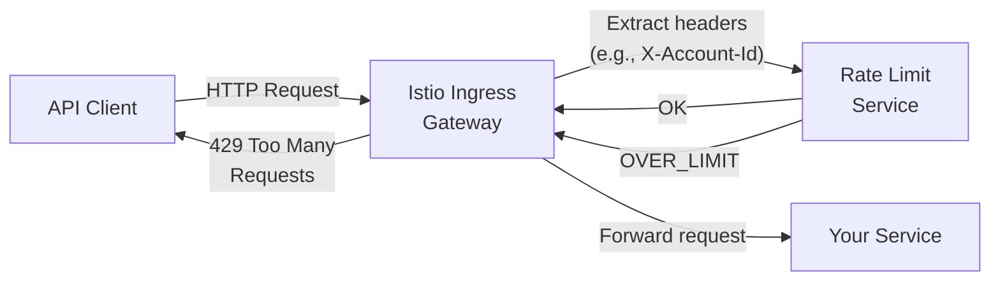
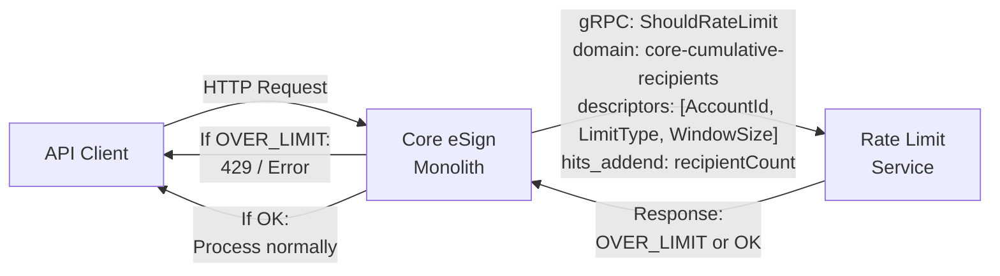
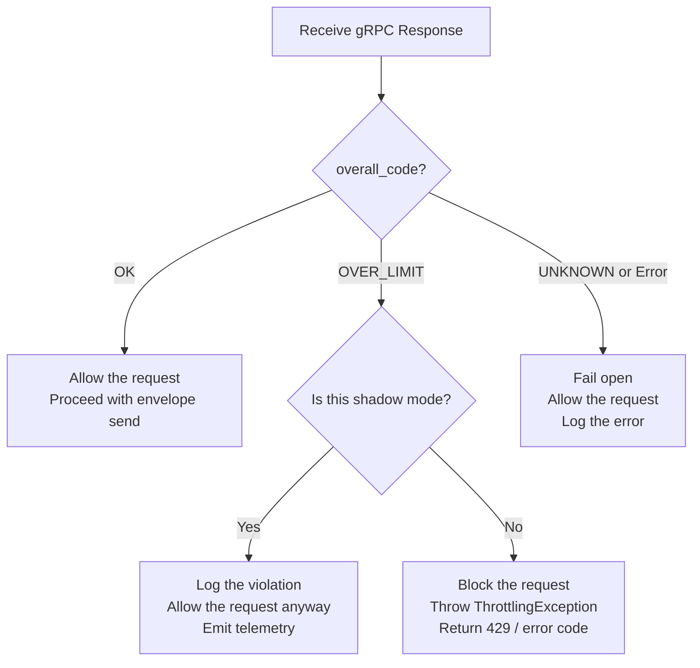
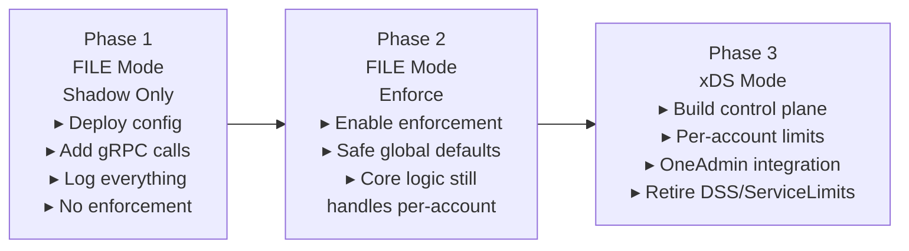

# Learning Guide: MSF Global Rate Limiting

> **Audience**: Engineers who have NOT worked with MSF or Kubernetes before.  
> **Goal**: Understand the MSF Global Rate Limiting service well enough to integrate it with Core envelope/recipient limits.  
> **Print-friendly**: This document is designed to be printed and read offline.

---

## Table of Contents

1. [Part 1 – Foundation Concepts](#part-1--foundation-concepts)
   - [What is Kubernetes?](#11-what-is-kubernetes)
   - [What is MSF?](#12-what-is-msf-microservices-framework)
   - [What is Rate Limiting?](#13-what-is-rate-limiting)
2. [Part 2 – MSF Global Rate Limiting Service](#part-2--msf-global-rate-limiting-service)
   - [Architecture Overview](#21-architecture-overview)
   - [Core Concepts](#22-core-concepts)
   - [How Descriptors Work](#23-how-descriptors-work-critical)
   - [Configuration Format](#24-configuration-format-file-mode)
   - [FILE Mode Deep Dive](#25-file-mode-deep-dive)
   - [xDS Mode Deep Dive](#26-xds-mode-deep-dive)
   - [FILE vs xDS Comparison](#27-file-vs-xds-comparison)
3. [Part 3 – Integration Patterns](#part-3--integration-patterns)
   - [Integration Mode 1: Ingress Gateway](#31-integration-mode-1-ingress-gateway-no-code)
   - [Integration Mode 2: Direct gRPC Call](#32-integration-mode-2-direct-grpc-call-our-path)
   - [The gRPC Request/Response](#33-the-grpc-requestresponse)
   - [Interpreting the Response](#34-interpreting-the-response)
4. [Part 4 – Onboarding Process](#part-4--onboarding-process)
5. [Part 5 – Telemetry and Monitoring](#part-5--telemetry-and-monitoring)
6. [Part 6 – Important Limitations](#part-6--important-limitations)
7. [Part 7 – Our Planned Integration](#part-7--our-planned-integration)
8. [Appendix A – Glossary](#appendix-a--glossary)
9. [Appendix B – Key Links](#appendix-b--key-links)

---

## Part 1 – Foundation Concepts

### 1.1 What is Kubernetes?

Kubernetes (K8s) is an **orchestration platform** for running containerized applications. Think of it as an operating system for a cluster of machines:

```
┌─────────────────────────────────────────────────────────┐
│                    Kubernetes Cluster                     │
│                                                          │
│  ┌──────────┐  ┌──────────┐  ┌──────────┐               │
│  │  Node 1   │  │  Node 2   │  │  Node 3   │  ...        │
│  │ ┌──────┐  │  │ ┌──────┐  │  │ ┌──────┐  │             │
│  │ │ Pod  │  │  │ │ Pod  │  │  │ │ Pod  │  │             │
│  │ │(App) │  │  │ │(App) │  │  │ │(App) │  │             │
│  │ └──────┘  │  │ └──────┘  │  │ └──────┘  │             │
│  └──────────┘  └──────────┘  └──────────┘               │
└─────────────────────────────────────────────────────────┘
```

**Key terms you'll encounter:**

| Term | What it means |
|------|---------------|
| **Pod** | The smallest deployable unit. Contains one or more containers running your application. |
| **Service** | A stable network address (DNS name) that routes traffic to a set of Pods. For example, `ratelimit.ratelimit.svc.cluster.local` is a service. |
| **Namespace** | A virtual partition inside the cluster. Different teams/apps get their own namespace to avoid conflicts. |
| **Helm Chart** | A packaging format for K8s applications. Think of it as a "template" to deploy a service with all its configuration. |
| **Helm Release** | A specific deployment of a Helm Chart. When you deploy your service, it creates a "release" with a specific name. |

**Why this matters for us**: The MSF rate limiter runs as a Kubernetes service. Our Core monolith will call it over the network via gRPC. We don't need to manage K8s ourselves — the Service Protection team owns the rate limiter service.

### 1.2 What is MSF (Microservices Framework)?

MSF is **Docusign's internal platform** for building and deploying microservices in Azure/Kubernetes. It provides:

1. **Standard infrastructure** — logging, monitoring, configuration, secrets management
2. **Shared services** — rate limiting, authentication, circuit breaking
3. **Deployment tooling** — CI/CD pipelines, Helm charts, environment management



**Key point**: MSF's Global Rate Limiting is one **shared service** within this platform. It's a central, Redis-backed service that any microservice can call to check or enforce rate limits.

### 1.3 What is Rate Limiting?

Rate limiting **restricts how many operations** a user/account can perform within a time window. It prevents abuse and protects the system from overload.

**Example**: "Account X can send a maximum of 5,000 recipient sends in 30 days."

```
Time Window: 30 days
         ┌──────────────────────────────────────────┐
         │  Sends:  ███████████████████░░░░░░░░░░░░  │
         │          4,200 / 5,000                     │
         │          ▲                                  │
         │          OK — under limit                   │
         └──────────────────────────────────────────┘

vs.

         ┌──────────────────────────────────────────┐
         │  Sends:  ██████████████████████████████████│
         │          5,001 / 5,000                     │
         │          ▲                                  │
         │          BLOCKED — over limit               │
         └──────────────────────────────────────────┘
```

**Two common approaches:**
- **Fixed-time-window**: The counter resets at fixed intervals (e.g., every 30 days from a start point). ← **MSF uses this today.**
- **Sliding-time-window**: The window slides continuously. More precise, but more complex. ← **Planned for future by MSF.**

---

## Part 2 – MSF Global Rate Limiting Service

### 2.1 Architecture Overview

The rate limiting service is a **Go-based application** running in Kubernetes, backed by **Azure Cache for Redis Premium**.



**The flow is simple:**
1. Your service sends a gRPC request: "Should I rate-limit this request?" with descriptors (metadata about who/what).
2. The rate limiter looks up the matching rule configuration.
3. It checks/increments a counter in Redis.
4. It returns `OK` (under limit) or `OVER_LIMIT` (exceeded).

### 2.2 Core Concepts

#### Domain

A **domain** is a namespace for your rate limits. It isolates your limits from other services' limits. Format:

```
{{ .Release.Namespace }}-{{ .Release.Name }}
```

In practice, this resolves to something like: `my-namespace-my-service-name`

For our integration, we'd propose a domain like: `core-cumulative-recipients`

#### Descriptors

A **descriptor** is a key-value pair that describes the request being rate-limited. Descriptors are hierarchical — they form a **tree** that the rate limiter walks to find the matching rule.

```
domain: core-cumulative-recipients
  └── descriptor: AccountId = "abc-123"
        └── descriptor: LimitType = "recipientSends"
              └── descriptor: WindowSize = "LargeWindow"   ← MATCH → apply limit
```

#### Hits (hits_addend)

The **hits_addend** field tells the rate limiter how many units to count for this request. For example:
- For `recipientSends`: `hits_addend = number_of_recipients_in_this_envelope`
- For `envelopeSends`: `hits_addend = 1` (one envelope)

### 2.3 How Descriptors Work (CRITICAL)

This is the most important concept to understand. The rate limiter uses **hierarchical descriptor matching**.

#### Rule: Descriptors MUST match the COMPLETE path

The rate limiter walks the descriptor tree from the configuration. The request must provide descriptors that **exactly match the entire path** from root to leaf.

```
Configuration Tree:             Request Descriptors:
                                
AccountId                       AccountId = "abc-123"    ✓
  └── LimitType                 LimitType = "recipientSends"  ✓
        └── WindowSize          WindowSize = "LargeWindow"    ✓
                                                          = MATCH!
```

#### Rule: Partial matches return OK (no limit)

If the request provides only part of the path, the rate limiter returns `OK` — it does NOT enforce any limit. This is a safety mechanism but also a common source of bugs.

```
Configuration Tree:             Request Descriptors:
                                
AccountId                       AccountId = "abc-123"    ✓
  └── LimitType                 LimitType = "recipientSends"  ✓
        └── WindowSize          (missing!)                ✗
                                                          = NO MATCH → OK
```

#### Rule: Order of descriptors matters

The descriptors in the request must be provided in the **same order** as they appear in the configuration. Reordering causes a mismatch.

#### Visual: The Descriptor Matching Algorithm



### 2.4 Configuration Format (FILE Mode)

In FILE mode, rate limit rules are defined in a YAML file stored in the MSF repository (your service's Helm chart).

Here's our proposed configuration:

```yaml
domain: core-cumulative-recipients
descriptors:
  # Level 1: AccountId (any value)
  - key: AccountId
    descriptors:
      # Level 2: LimitType
      - key: LimitType
        value: recipientSends
        descriptors:
          # Level 3: WindowSize
          - key: WindowSize
            value: LargeWindow
            rate_limit:
              unit: day          # Counter resets every N days
              requests_per_unit: 5000    # Max 5000 recipients in window
              unlimited: false
            shadow_mode: false   # false = enforce, true = log only
          - key: WindowSize
            value: SmallWindow
            rate_limit:
              unit: day
              requests_per_unit: 500
              unlimited: false
            shadow_mode: false

      - key: LimitType
        value: envelopeSends
        descriptors:
          - key: WindowSize
            value: LargeWindow
            rate_limit:
              unit: day
              requests_per_unit: 1000
              unlimited: false
            shadow_mode: false
          - key: WindowSize
            value: SmallWindow
            rate_limit:
              unit: day
              requests_per_unit: 100
              unlimited: false
            shadow_mode: false
```

#### Configuration Fields Explained

| Field | Description | Example |
|-------|-------------|---------|
| `domain` | Namespace for your limits. Must be unique. | `core-cumulative-recipients` |
| `key` | The descriptor key to match. | `AccountId`, `LimitType` |
| `value` | Optional. If set, must match exactly. If absent, matches any value. | `recipientSends` |
| `rate_limit.unit` | Time unit for the window. One of: `second`, `minute`, `hour`, `day`. | `day` |
| `rate_limit.requests_per_unit` | Maximum allowed requests in the window. | `5000` |
| `shadow_mode` | If `true`, logs but does NOT enforce. Great for testing. | `false` |
| `unlimited` | If `true`, no limit is applied (counter still tracks). | `false` |

#### Shadow Mode: Your Best Friend for Rollout

Shadow mode lets you deploy the rate limiter configuration without actually blocking any requests. The counters are tracked and logged, but `OVER_LIMIT` is never returned. This is critical for our phased rollout:

```
Phase 1: shadow_mode: true   → Deploy, observe counters, validate correctness
Phase 2: shadow_mode: false  → Enable enforcement for a small set of accounts
Phase 3: shadow_mode: false  → Full rollout
```

### 2.5 FILE Mode Deep Dive

**How it works:**



**Characteristics:**
- Config lives in the **MSF service repository** as a YAML file
- Changes go through **PR review → merge → deploy** pipeline
- Propagation time: **~30 seconds** after deployment (file watcher poll interval)
- Configuration is **baked into the deployment** — same config for all requests in that environment
- **14 microservices** currently use this mode in production

**Limitation for us**: FILE mode means **one fixed limit per descriptor path**. Every `AccountId` gets the same `requests_per_unit`. We cannot have Account A = 5,000 and Account B = 10,000 without xDS or external logic.

### 2.6 xDS Mode Deep Dive

**xDS** (eXtensible Discovery Service) is a protocol from the Envoy proxy ecosystem. In this mode, the rate limiter fetches its configuration dynamically from a **gRPC control plane** instead of a static file.

**How it works:**



**Characteristics:**
- Config lives in a **database** (that you own)
- Changes propagate in **< 5 seconds** via gRPC streaming
- Enables **per-account limits** (different limits for different accounts)
- **0 microservices** currently use this mode in production (only test code exists)
- Requires you to build the **xDS control plane server** (gRPC server implementing the xDS protocol)

**Why xDS matters for our future**:

```
┌─────────────────────────────────────────────────────┐
│  Current World (DSS + Account Admin)                 │
│                                                      │
│  Admin changes limit → DSS segment update            │
│  OR: Account Admin → Service Limits row              │
│  Result: Limit is read at runtime by Core code       │
│                                                      │
│  Problem: Config scattered, no API, manual process   │
├─────────────────────────────────────────────────────┤
│  Future World (xDS Mode)                             │
│                                                      │
│  OneAdmin changes limit → Database → xDS → RLS       │
│  Result: Limit is enforced by MSF centrally           │
│                                                      │
│  Benefit: Self-service UI, API, centralized config   │
└─────────────────────────────────────────────────────┘
```

### 2.7 FILE vs xDS Comparison

| Aspect | FILE Mode | xDS Mode |
|--------|-----------|----------|
| **Config storage** | YAML file in MSF repo | Your database |
| **Change process** | PR → merge → deploy | API call → DB → gRPC push |
| **Propagation speed** | ~30 seconds | < 5 seconds |
| **Per-account limits** | ❌ No (one limit for all) | ✅ Yes |
| **Production usage** | ✅ 14 services | ❌ 0 services |
| **Requires you to build** | Nothing (config only) | xDS control plane server |
| **Best for** | Global defaults | Per-account overrides |
| **Risk level** | Low (proven) | Higher (unproven in prod) |

#### Decision for our integration:



---

## Part 3 – Integration Patterns

### 3.1 Integration Mode 1: Ingress Gateway (No-Code)

The simplest integration. The MSF Istio Ingress Gateway can rate-limit requests before they reach your service, based on HTTP headers.



**Pros**: Zero code changes. Just configure the gateway.  
**Cons**: Limited to HTTP headers. Cannot express complex business logic (like "count recipients, not requests").  
**Verdict for us**: ❌ **Not suitable**. We need to count recipients per envelope, not just HTTP requests.

### 3.2 Integration Mode 2: Direct gRPC Call (Our Path)

Your service calls the rate limiter directly via gRPC. Full control over descriptors and `hits_addend`.



**This is our integration path.** We control exactly:
- What descriptors to send
- What `hits_addend` value to use (number of recipients, or 1 for envelope sends)
- How to handle the response (throw `ThrottlingException`, log, etc.)

### 3.3 The gRPC Request/Response

**NuGet package**: `DocuSign.Protobuf.DocuSign.Ratelimit.V1`

**Endpoint**: `ratelimit.ratelimit.svc.cluster.local:8081`

#### Request Structure (Protobuf)

```protobuf
message RateLimitRequest {
    string domain = 1;                          // "core-cumulative-recipients"
    repeated RateLimitDescriptor descriptors = 2; // Hierarchical key-value pairs
    uint32 hits_addend = 3;                     // How many to count (e.g., 5 recipients)
}

message RateLimitDescriptor {
    repeated Entry entries = 1;

    message Entry {
        string key = 1;   // e.g., "AccountId"
        string value = 2; // e.g., "abc-123-def-456"
    }
}
```

#### Response Structure (Protobuf)

```protobuf
message RateLimitResponse {
    Code overall_code = 1;                       // OK or OVER_LIMIT
    repeated DescriptorStatus statuses = 2;      // Per-descriptor details

    enum Code {
        UNKNOWN = 0;
        OK = 1;
        OVER_LIMIT = 2;
    }
}

message DescriptorStatus {
    RateLimitResponse.Code code = 1;             // Per-descriptor result
    RateLimit current_limit = 2;                 // The matching limit config
    uint32 limit_remaining = 3;                  // How many left in window
    Duration duration_until_reset = 4;           // Time until counter resets
}
```

#### Example: Checking recipientSends for an Account

**Request:**
```json
{
    "domain": "core-cumulative-recipients",
    "descriptors": [
        { "entries": [{ "key": "AccountId", "value": "abc-123" }] },
        { "entries": [{ "key": "LimitType", "value": "recipientSends" }] },
        { "entries": [{ "key": "WindowSize", "value": "LargeWindow" }] }
    ],
    "hits_addend": 5
}
```

**Response (under limit):**
```json
{
    "overall_code": "OK",
    "statuses": [
        {
            "code": "OK",
            "current_limit": {
                "requests_per_unit": 5000,
                "unit": "DAY"
            },
            "limit_remaining": 4200,
            "duration_until_reset": "1296000s"
        }
    ]
}
```

**Response (over limit):**
```json
{
    "overall_code": "OVER_LIMIT",
    "statuses": [
        {
            "code": "OVER_LIMIT",
            "current_limit": {
                "requests_per_unit": 5000,
                "unit": "DAY"
            },
            "limit_remaining": 0,
            "duration_until_reset": "432000s"
        }
    ]
}
```

### 3.4 Interpreting the Response



**Critical design principle**: Always **fail open** on errors. If the rate limiter is down or returns an error, allow the request. Rate limiting should never be a hard dependency that causes outages.

---

## Part 4 – Onboarding Process

To integrate with MSF Global Rate Limiting, follow these steps:

### Step 1: Coordinate with Service Protection Team

Contact **#eng-svc-protection** Slack channel. They own the rate limiting service and need to:
- Review your proposed domain and descriptor structure
- Provision access (authz policy)
- Help with initial configuration

### Step 2: Define Your Configuration

Design your descriptor hierarchy and limits:

```yaml
domain: core-cumulative-recipients
descriptors:
  - key: AccountId
    descriptors:
      - key: LimitType
        value: recipientSends
        descriptors:
          - key: WindowSize
            value: LargeWindow
            rate_limit:
              unit: day
              requests_per_unit: 5000
```

### Step 3: Submit Authorization PR

Submit a PR to the MSF rate limiter's `authz-policy` to allow your service to call it. The Service Protection team will guide the exact format.

### Step 4: Deploy Configuration

- **FILE mode**: Add the YAML config to your service's Helm chart and deploy.
- **xDS mode**: Build and deploy your xDS control plane server, then configure the rate limiter to connect to it.

### Step 5: Shadow Mode Testing

Deploy with `shadow_mode: true`. Monitor counters in Grafana for at least 1 week before enabling enforcement.

### Step 6: Enable Enforcement

Switch `shadow_mode: false` and deploy. Monitor closely.

---

## Part 5 – Telemetry and Monitoring

### Grafana Dashboards

The MSF rate limiter exposes metrics that are visualized in Grafana:

| Dashboard | URL |
|-----------|-----|
| Dev environments | `https://grafana.ds-unitydev.net/` |
| Production | `https://grafana.ds-unity.net/` |

**Key metrics to monitor:**

| Metric | What it tells you |
|--------|------------------|
| `ratelimit_total_hits` | Total requests to the rate limiter, by domain |
| `ratelimit_over_limit` | Requests that were rate-limited (OVER_LIMIT) |
| `ratelimit_near_limit` | Requests approaching the limit (early warning) |
| `ratelimit_service_total_latency` | gRPC call latency (should be < 5ms) |

### Kusto Queries

For deeper analysis, query the DSEvents in Kusto:

```kql
DSEvents
| where Timestamp > ago(1d)
| where Data has 'EnvelopeSends' and FullName has 'Platform.Web'
| extend
    PlanName = tostring(Data.DataPoints.PlanName),
    LargeWindowLimit = toint(Data.ServiceProtection.EnvelopeSends.Keys.AccountId.LargeWindow.LockoutThreshold),
    LargeWindowCount = toint(Data.ServiceProtection.EnvelopeSends.Keys.AccountId.LargeWindow.Count),
    Result = tostring(Data.ServiceProtection.EnvelopeSends.Result)
| where Result has 'blocked'
| project Timestamp, Site, PlanName, LargeWindowCount, LargeWindowLimit, Result
| top 100 by Timestamp
```

---

## Part 6 – Important Limitations

### 1. Fixed-Time-Window Only (Today)

MSF uses a **fixed time window**. The counter resets at a specific point, not sliding. This means:

```
Fixed window (MSF today):
 
Day 1          Day 30         Day 31
|──────────────|──────────────|
  Counter: 4999    RESET!  Counter: 0
  (Almost at limit)         (Fresh start)
  
A burst at end of window + start of next = 2x limit in short period
```

Sliding window (future improvement) would smooth this out.

### 2. No Cross-Datacenter Replication

Each datacenter has its **own Redis instance** and therefore its own counters. If an account sends from DC1 and DC2, each DC tracks independently.

```
DC1 (NA1):  Counter = 3,000 / 5,000
DC2 (NA2):  Counter = 2,500 / 5,000
                              
Actual total: 5,500 — but neither DC blocks!
```

**Implication for us**: This is actually similar to how our current Sauce-based counters work. Not a regression.

### 3. Configuration is Global in FILE Mode

In FILE mode, the same `requests_per_unit` applies to ALL accounts. You cannot set per-account limits.

**Workaround (Phase 1)**: Set the limit to a safe high value. Continue using Core business logic (DSS, Account Admin) for per-account enforcement. The MSF rate limiter acts as a **global safety net**.

### 4. Descriptor Order Matters

Descriptors must be sent in the exact same order as configured. Misordering = no match = no enforcement.

### 5. No Built-in Retry or Circuit Breaker

Your code must implement resilience patterns (retry, circuit breaker, fail-open) when calling the rate limiter.

---

## Part 7 – Our Planned Integration

### What We're Building

We want to move `recipientSends` and `envelopeSends` limits from the Core monolith to MSF's centralized rate limiter. This enables:

1. **Self-service via OneAdmin** (instead of TECHOPS tickets to update DSS)
2. **Centralized enforcement** (instead of scattered DSS + ServiceLimits + AccountAdmin)
3. **Real-time counter visibility** (via Redis, not Sauce batch updates)

### Our Descriptor Hierarchy

```yaml
domain: core-cumulative-recipients
  └── AccountId: <guid>
        ├── LimitType: recipientSends
        │     ├── WindowSize: LargeWindow  → 5,000 / 30 days
        │     └── WindowSize: SmallWindow  → 500 / 1 day
        └── LimitType: envelopeSends
              ├── WindowSize: LargeWindow  → 1,000 / 30 days
              └── WindowSize: SmallWindow  → 100 / 3 days
```

### How Many gRPC Calls Per Envelope?

**Two calls per envelope send:**

```
Call 1: recipientSends
  domain: core-cumulative-recipients
  descriptors: [AccountId, LimitType=recipientSends, WindowSize=LargeWindow]
  hits_addend: <number_of_recipients>

Call 2: envelopeSends  
  domain: core-cumulative-recipients
  descriptors: [AccountId, LimitType=envelopeSends, WindowSize=LargeWindow]
  hits_addend: 1
```

*(Small window calls would be 2 additional calls, or we batch them. TBD with Service Protection team.)*

### Phased Rollout Plan



### What Stays in Core (Business Logic)

Even with MSF enforcement, some logic **must remain in Core**:

| Logic | Why it stays |
|-------|-------------|
| SecOps trust multiplier (3x) | Per-account trust status from account settings |
| Signing group expansion | Count individual members, not the group |
| Account age calculation | Complex logic: `max(account.Created, prevPlanEndDate)` |
| Per-account overrides | Until xDS mode is built |

---

## Appendix A – Glossary

| Term | Definition |
|------|-----------|
| **MSF** | Microservices Framework — Docusign's platform for building cloud services |
| **gRPC** | Google Remote Procedure Call — binary protocol for service-to-service communication |
| **Protobuf** | Protocol Buffers — binary serialization format used by gRPC |
| **xDS** | eXtensible Discovery Service — dynamic config protocol from Envoy ecosystem |
| **SOTW** | State Of The World — xDS variant where full config is sent on each update |
| **Descriptor** | A key-value pair describing a rate-limited request |
| **Domain** | A namespace isolating one service's rate limits from another's |
| **Shadow mode** | Log-only mode; counters track but enforcement is disabled |
| **hits_addend** | The number of units to count for one request |
| **Fixed-time-window** | Counter resets at fixed intervals (e.g., every 30 days) |
| **Sliding-time-window** | Counter slides continuously; more precise enforcement |
| **Fail open** | On error, allow the request (don't block due to rate limiter failure) |
| **DSS** | Dynamic System Settings — Docusign's runtime configuration system |
| **Sauce** | Docusign's proprietary NoSQL store, used for runtime counters |
| **Helm** | Package manager for Kubernetes; uses "charts" (templates) for deployment |
| **ConfigMap** | Kubernetes object for storing configuration data (key-value pairs) |
| **Redis** | In-memory data store used as the counter backend for MSF rate limiting |
| **Istio** | Service mesh for Kubernetes; provides traffic management, security, observability |

## Appendix B – Key Links

| Resource | URL / Location |
|----------|---------------|
| MSF Ratelimit Onboarding | Confluence: "MSF Global Rate Limiting Onboarding" |
| Service Protection FAQs | Confluence: "Service Protection MSF / Azure FAQs" |
| NuGet Package | `DocuSign.Protobuf.DocuSign.Ratelimit.V1` |
| gRPC Endpoint | `ratelimit.ratelimit.svc.cluster.local:8081` |
| Slack Channel | `#eng-svc-protection` |
| Grafana (Dev) | `https://grafana.ds-unitydev.net/` |
| Grafana (Prod) | `https://grafana.ds-unity.net/` |
| MSF GitHub Repo | `Microservices/ratelimit` (internal) |

---

*Document created: 2026-02-07*  
*Purpose: Self-study learning guide for MSF Global Rate Limiting integration*
