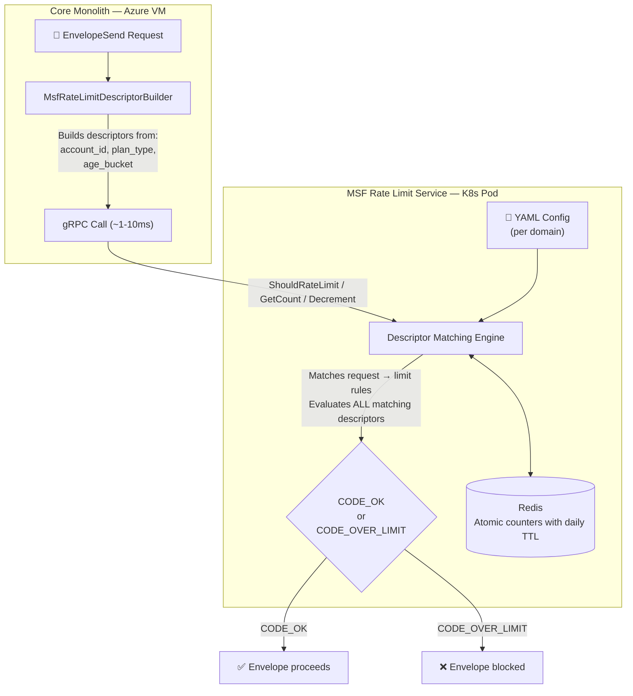
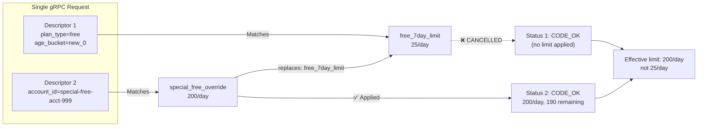

# MSF Rate Limit — Realistic Demo Scenarios

> **Purpose:** Showcase how the MSF Global Rate Limiting service works end-to-end using realistic eSign scenarios.  
> **Environment:** Local MSF ratelimit service instance (`localhost:8081`) backed by Redis  
> **Date:** February 2026

---

## Table of Contents

1. [How It Works (30-Second Summary)](#1-how-it-works)
2. [YAML Configuration (What Drives Limits)](#2-yaml-configuration)
3. [Scenario Walkthrough — Recipient Sends](#3-scenario-walkthrough--recipient-sends)
4. [Scenario Walkthrough — Envelope Sends](#4-scenario-walkthrough--envelope-sends)
5. [Scenario Walkthrough — Email Sends](#5-scenario-walkthrough--email-sends)
6. [Admin Operations (Dashboard & Reset)](#6-admin-operations)
7. [Key Takeaways](#7-key-takeaways)

---

## 1. How It Works



**Three RPCs available:**

| RPC | What It Does | When to Use |
|---|---|---|
| `ShouldRateLimit` | Check + increment counter | **Hot path** — every envelope/recipient/email send |
| `GetCount` | Read counter (no increment) | **Dashboard** — show current usage |
| `Decrement` | Subtract from counter | **Admin reset** — undo mistaken counts |

**Three domains (limit types):**

| Domain | Counts | Example |
|---|---|---|
| `esign_recipient_sends` | Number of recipients per envelope send | 5 recipients = hits_addend:5 |
| `esign_envelope_sends` | Number of envelopes sent | Always hits_addend:1 |
| `esign_email_sends` | Number of emails dispatched | 10 emails in batch = hits_addend:10 |

**Supported time units:**

| YAML `unit` | `length_of_time` | Window | Example |
|---|---|---|---|
| `day` | 1 *(default)* | 1 day | `5000 requests/day` |
| `day` | `30` | 30 days | `50000 requests per 30 days` |
| `hour` | 1 *(default)* | 1 hour | `100 requests/hour` |
| `minute` | 1 *(default)* | 1 minute | `10 requests/minute` |
| `month` | 1 *(default)* | 1 month | `100000 requests/month` |
| `year` | 1 *(default)* | 1 year | `1000000 requests/year` |

> The `length_of_time` field allows custom windows (e.g., `unit: day` + `length_of_time: 30` = a 30-day rolling window). If omitted, it defaults to 1.

---

## 2. YAML Configuration

The YAML config is the **single source of truth** for all limit rules. It's deployed per K8s cluster and hot-reloaded without restarts.

### 2a. esign_recipient_sends (Most Complex)

This domain has tiered limits by plan type, account age, and per-account overrides:

```yaml
domain: esign_recipient_sends
descriptors:
  # ─── Default: Any paid account = 5000 recipients/day ───
  - key: account_id
    rate_limit:
      name: recipient_send_limit
      unit: day
      requests_per_unit: 5000

  # ─── Free/Trial plans — tiered by account age ───
  - key: plan_type
    value: free
    descriptors:
      - key: age_bucket
        value: new_0                    # Account is 0-7 days old
        rate_limit:
          name: free_7day_limit
          unit: day
          requests_per_unit: 25         # Very restrictive for new free accounts
      - key: age_bucket                 # Any other age (8+ days)
        rate_limit:
          name: free_older_limit
          unit: day
          requests_per_unit: 50

  # ─── Paid plans — tiered by account age ───
  - key: age_bucket
    value: new_0                        # Paid account, 0-7 days old
    rate_limit:
      name: paid_7day_limit
      unit: day
      requests_per_unit: 250

  - key: age_bucket
    value: new_30                       # Paid account, 8-30 days old
    rate_limit:
      name: paid_30day_limit
      unit: day
      requests_per_unit: 500

  # ─── Per-Account Override: Custom 200/day for a specific free account ───
  # This customer requested a higher limit. The "replaces" keyword
  # cancels the free_7day_limit (25/day) and applies 200/day instead.
  - key: account_id
    value: "special-free-acct-999"
    rate_limit:
      replaces:
        - name: free_7day_limit
        - name: free_older_limit
        - name: recipient_send_limit
      name: special_free_override
      unit: day
      requests_per_unit: 200

  # ─── Excluded Account (Elevated Limit) ───
  # Whale customer or internal account — granted same limit as paid.
  - key: account_id
    value: "9d256e27-b4ca-4cd7-9d20-bdbf6d57e3af"
    rate_limit:
      replaces:
        - name: recipient_send_limit
        - name: paid_7day_limit
        - name: paid_30day_limit
        - name: free_7day_limit
        - name: free_older_limit
      name: excluded_account_limit
      unit: day
      requests_per_unit: 5000
```

### 2b. esign_envelope_sends

Simpler — primarily plan-level limits:

```yaml
domain: esign_envelope_sends
descriptors:
  # Default: 1000 envelopes/day per plan
  - key: plan_id
    rate_limit:
      name: envelope_send_limit
      unit: day
      requests_per_unit: 1000

  # Distributor code fallback (same default)
  - key: distributor_code
    rate_limit:
      name: envelope_send_limit
      unit: day
      requests_per_unit: 1000
```

### 2c. esign_email_sends

Email dispatch throttling:

```yaml
domain: esign_email_sends
descriptors:
  # Default: 4500 emails/day per plan
  - key: plan_id
    rate_limit:
      name: email_send_limit
      unit: day
      requests_per_unit: 4500

  # Distributor code fallback
  - key: distributor_code
    rate_limit:
      name: email_send_limit
      unit: day
      requests_per_unit: 4500
```

---

## 3. Scenario Walkthrough — Recipient Sends

### Scenario 1: Normal Paid Account Sends Envelope with 5 Recipients

**Context:** Account `acct-abc-123` is a paid enterprise account, 6 months old. User sends an envelope with 5 recipients.

**Request:**
```json
{
  "domain": "esign_recipient_sends",
  "descriptors": [
    {
      "entries": [
        { "key": "account_id", "value": "acct-abc-123" }
      ]
    }
  ],
  "hits_addend": 5
}
```

**Response:**
```json
{
  "overallCode": "CODE_OK",
  "statuses": [
    {
      "code": "CODE_OK",
      "currentLimit": {
        "requestsPerUnit": 5000,
        "unit": "UNIT_DAY",
        "name": "recipient_send_limit"
      },
      "limitRemaining": 4995,
      "durationUntilReset": "72540s"
    }
  ]
}
```

**What happened:**
- Matched the default `account_id` descriptor → `recipient_send_limit` (5000/day)
- Incremented counter by 5 → 4995 remaining
- `durationUntilReset: 72540s` ≈ 20 hours until the daily counter resets
- **Result: ✅ ALLOWED** — envelope proceeds

---

### Scenario 2: Free Trial Account (3 Days Old) Sends 3 Recipients

**Context:** Account `free-trial-acct-001` is on a free plan, created 3 days ago. The caller sends TWO descriptor sets — plan-level AND account-level — in the same request. MSF evaluates both.

**Request:**
```json
{
  "domain": "esign_recipient_sends",
  "descriptors": [
    {
      "entries": [
        { "key": "plan_type", "value": "free" },
        { "key": "age_bucket", "value": "new_0" }
      ]
    },
    {
      "entries": [
        { "key": "account_id", "value": "free-trial-acct-001" }
      ]
    }
  ],
  "hits_addend": 3
}
```

**Response:**
```json
{
  "overallCode": "CODE_OK",
  "statuses": [
    {
      "code": "CODE_OK",
      "currentLimit": {
        "requestsPerUnit": 25,
        "unit": "UNIT_DAY",
        "name": "free_7day_limit"
      },
      "limitRemaining": 22,
      "durationUntilReset": "72524s"
    },
    {
      "code": "CODE_OK",
      "currentLimit": {
        "requestsPerUnit": 5000,
        "unit": "UNIT_DAY",
        "name": "recipient_send_limit"
      },
      "limitRemaining": 4997,
      "durationUntilReset": "72524s"
    }
  ]
}
```

**What happened:**
- **Status 1:** Matched `plan_type=free → age_bucket=new_0` → `free_7day_limit` (25/day). Used 3, 22 remaining.
- **Status 2:** Matched default `account_id` → `recipient_send_limit` (5000/day). Used 3, 4997 remaining.
- Both statuses are `CODE_OK` → overall is `CODE_OK`
- **Result: ✅ ALLOWED** — the 25/day limit is the effective constraint (more restrictive)

---

### Scenario 3: Same Free Account Hits the 25/Day Limit

**Context:** Same free trial account tries to send 25 more recipients (total would be 28, exceeding the 25/day limit).

**Request:** Same as Scenario 2, but `hits_addend: 25`

**Response:**
```json
{
  "overallCode": "CODE_OVER_LIMIT",
  "statuses": [
    {
      "code": "CODE_OVER_LIMIT",
      "currentLimit": {
        "requestsPerUnit": 25,
        "unit": "UNIT_DAY",
        "name": "free_7day_limit"
      },
      "durationUntilReset": "72519s"
    },
    {
      "code": "CODE_OK",
      "currentLimit": {
        "requestsPerUnit": 5000,
        "unit": "UNIT_DAY",
        "name": "recipient_send_limit"
      },
      "limitRemaining": 4972,
      "durationUntilReset": "72519s"
    }
  ]
}
```

**What happened:**
- **Status 1:** `CODE_OVER_LIMIT` — 28 > 25 daily limit. `limitRemaining` not shown when over limit.
- **Status 2:** `CODE_OK` — the account-level 5000/day limit is still fine.
- **If ANY status is `OVER_LIMIT`, the overall code is `OVER_LIMIT`**
- **Result: ❌ BLOCKED** — Core rejects the envelope send, returns error to user

---

### Scenario 4: Per-Account Override (Special Free Account Gets 200/Day)

**Context:** Account `special-free-acct-999` is on a free plan, but a support request granted them 200/day. The YAML has a `replaces` entry that cancels the `free_7day_limit` (25/day) and applies `special_free_override` (200/day) instead.

**Request:** Same structure — plan-level + account-level descriptors:
```json
{
  "domain": "esign_recipient_sends",
  "descriptors": [
    {
      "entries": [
        { "key": "plan_type", "value": "free" },
        { "key": "age_bucket", "value": "new_0" }
      ]
    },
    {
      "entries": [
        { "key": "account_id", "value": "special-free-acct-999" }
      ]
    }
  ],
  "hits_addend": 10
}
```

**Response:**
```json
{
  "overallCode": "CODE_OK",
  "statuses": [
    {
      "code": "CODE_OK"
    },
    {
      "code": "CODE_OK",
      "currentLimit": {
        "requestsPerUnit": 200,
        "unit": "UNIT_DAY",
        "name": "special_free_override"
      },
      "limitRemaining": 190,
      "durationUntilReset": "72515s"
    }
  ]
}
```

**What happened:**
- **Status 1:** `CODE_OK` with NO `currentLimit` — the `free_7day_limit` was **cancelled** by the `replaces` keyword in the account override. The counter was never checked.
- **Status 2:** Matched `account_id=special-free-acct-999` → `special_free_override` (200/day). Used 10, 190 remaining.
- **The `replaces` mechanism is the key** — the caller's code NEVER changes. Only the YAML config changes to add/remove overrides.
- **Result: ✅ ALLOWED** — this account gets 200/day instead of the default 25/day

---

### Scenario 5: Excluded Account (Elevated to Paid Tier)

**Context:** Account `9d256e27-b4ca-4cd7-9d20-bdbf6d57e3af` is on a free plan but is a whale customer. Instead of the default 25/day free-tier limit, the YAML override grants them the same 5000/day as paid accounts. The `replaces` keyword cancels the free-tier limit and applies the elevated one.

**Request:** Same structure, `hits_addend: 1000`

**Response:**
```json
{
  "overallCode": "CODE_OK",
  "statuses": [
    {
      "code": "CODE_OK"
    },
    {
      "code": "CODE_OK",
      "currentLimit": {
        "requestsPerUnit": 5000,
        "unit": "UNIT_DAY",
        "name": "excluded_account_limit"
      },
      "limitRemaining": 4000,
      "durationUntilReset": "72510s"
    }
  ]
}
```

**What happened:**
- **Status 1:** `CODE_OK` — free-tier plan-level limit was cancelled by `replaces`
- **Status 2:** `excluded_account_limit` (5,000/day) applied. Sent 1000, 4000 remaining.
- This matches production behavior — we grant elevated numeric limits (not unlimited), so the counter is still tracked and visible in admin dashboards.
- **Result: ✅ ALLOWED** — free account gets paid-tier limits via config-only change

---

### Scenario Summary — Recipient Sends

| # | Account Type | Plan | Age | Recipients | Limit | Result |
|---|---|---|---|---|---|---|
| 1 | Paid enterprise | — | 6 months | 5 | 5000/day | ✅ OK (4995 left) |
| 2 | Free trial | free | 3 days | 3 | 25/day | ✅ OK (22 left) |
| 3 | Free trial (same) | free | 3 days | +25 | 25/day | ❌ OVER_LIMIT (28 > 25) |
| 4 | Free with override | free | 3 days | 10 | **200/day** | ✅ OK (190 left) |
| 5 | Excluded account | free | 3 days | 1000 | **5,000/day** | ✅ OK (4,000 left) |

---

## 4. Scenario Walkthrough — Envelope Sends

### Scenario 7: Standard Envelope Send

**Context:** Account sends 1 envelope. The limit is per plan (1000 envelopes/day).

**Request:**
```json
{
  "domain": "esign_envelope_sends",
  "descriptors": [
    {
      "entries": [
        { "key": "plan_id", "value": "enterprise-plan-001" }
      ]
    }
  ],
  "hits_addend": 1
}
```

**Response:**
```json
{
  "overallCode": "CODE_OK",
  "statuses": [
    {
      "code": "CODE_OK",
      "currentLimit": {
        "requestsPerUnit": 1000,
        "unit": "UNIT_DAY",
        "name": "envelope_send_limit"
      },
      "limitRemaining": 999,
      "durationUntilReset": "72499s"
    }
  ]
}
```

**Note:** `hits_addend` is always `1` for envelope sends — we count envelopes, not recipients. Recipient counting is handled by the `esign_recipient_sends` domain separately.

---

## 5. Scenario Walkthrough — Email Sends

### Scenario 8: Email Batch Dispatch

**Context:** The email notification system dispatches 10 emails for a completed envelope. Limit is 4500 emails/day per plan.

**Request:**
```json
{
  "domain": "esign_email_sends",
  "descriptors": [
    {
      "entries": [
        { "key": "plan_id", "value": "standard-plan-001" }
      ]
    }
  ],
  "hits_addend": 10
}
```

**Response:**
```json
{
  "overallCode": "CODE_OK",
  "statuses": [
    {
      "code": "CODE_OK",
      "currentLimit": {
        "requestsPerUnit": 4500,
        "unit": "UNIT_DAY",
        "name": "email_send_limit"
      },
      "limitRemaining": 4490,
      "durationUntilReset": "72494s"
    }
  ]
}
```

---

## 6. Admin Operations

### Scenario 6: Dashboard — View Current Usage (GetCount)

**Context:** Admin opens OneAdmin dashboard to see how much of their quota account `acct-abc-123` has used today. This call does NOT increment the counter.

**Request:**
```json
{
  "domain": "esign_recipient_sends",
  "descriptors": [
    {
      "entries": [
        { "key": "account_id", "value": "acct-abc-123" }
      ]
    }
  ]
}
```

**Response:**
```json
{
  "overallCode": "CODE_OK",
  "statuses": [
    {
      "counterStatus": "COUNTER_STATUS_FOUND",
      "count": 5,
      "code": "CODE_OK",
      "currentLimit": {
        "requestsPerUnit": 5000,
        "unit": "UNIT_DAY",
        "name": "recipient_send_limit"
      },
      "limitRemaining": 4995,
      "durationUntilReset": "72505s"
    }
  ]
}
```

**Key fields for the dashboard:**
- `count: 5` — this account has sent 5 recipients today
- `limitRemaining: 4995` — 4995 more recipients allowed today
- `requestsPerUnit: 5000` — total daily limit
- `durationUntilReset: 72505s` — counter resets in ~20 hours

---

### Scenario 9: Admin Reset — Decrement Counter

**Context:** A support case requires undoing 3 recipient counts for `acct-abc-123` (e.g., a failed send that already incremented the counter).

**Step 1 — Decrement:**
```json
{
  "domain": "esign_recipient_sends",
  "descriptors": [
    {
      "entries": [
        { "key": "account_id", "value": "acct-abc-123" }
      ]
    }
  ],
  "decrement": 3
}
```

**Response:** `{}` (empty — success)

**Step 2 — Verify with GetCount:**
```json
{
  "overallCode": "CODE_OK",
  "statuses": [
    {
      "counterStatus": "COUNTER_STATUS_FOUND",
      "count": 2,
      "code": "CODE_OK",
      "currentLimit": {
        "requestsPerUnit": 5000,
        "unit": "UNIT_DAY",
        "name": "recipient_send_limit"
      },
      "limitRemaining": 4998,
      "durationUntilReset": "72488s"
    }
  ]
}
```

**What happened:** Counter went from 5 → 2. The 3 mistaken counts were undone.

---

## 7. Key Takeaways

### How the `replaces` Mechanism Works

This is the most powerful feature of MSF ratelimit. It enables per-account overrides **without changing any code**:



**For normal accounts** (no override in YAML):
- Both descriptors evaluate independently
- The more restrictive one (25/day) is the effective blocker

**For override accounts** (entry in YAML with `replaces`):
- The plan-level limit is cancelled
- Only the account-specific limit applies
- **The calling code is identical** — only the YAML config differs

### What Each Field Means

| Response Field | Meaning |
|---|---|
| `overallCode` | `CODE_OK` = all allowed. `CODE_OVER_LIMIT` = at least one limit exceeded |
| `statuses[]` | One entry per descriptor set in the request |
| `code` | Per-descriptor result: `CODE_OK` or `CODE_OVER_LIMIT` |
| `currentLimit.name` | Which YAML limit rule matched |
| `currentLimit.requestsPerUnit` | The configured limit value |
| `currentLimit.unit` | Time window (`UNIT_DAY`, `UNIT_HOUR`, etc.) |
| `limitRemaining` | How many more hits before `OVER_LIMIT`. Absent when already over. |
| `durationUntilReset` | Seconds until the daily counter resets to 0 |
| `count` | Current counter value (only in `GetCount` response) |
| `counterStatus` | `COUNTER_STATUS_FOUND` = counter exists in Redis (only in `GetCount`) |

### Performance & Safety

| Aspect | Detail |
|---|---|
| **Latency** | ~1-10ms per gRPC call (network + Redis lookup) |
| **Overhead** | Negligible vs. total envelope send time (100-500ms+) |
| **Batching** | `hits_addend` = number of recipients, so 1 call per envelope (not per recipient) |
| **Failure mode** | Fail-open — if MSF is unreachable, allow the send (DSS-gated) |
| **Shadow mode** | DSS flag to run MSF in parallel with legacy DComp, log differences, don't enforce |
| **Counter reset** | Daily TTL in Redis — counters auto-expire |
| **Config reload** | YAML changes hot-reload without pod restart (< 30 seconds in K8s) |

### Limit Tier Summary

| Plan | Age | Recipient Limit | Envelope Limit | Email Limit |
|---|---|---|---|---|
| **Free** | 0-7 days | **25/day** | 1000/day | 4500/day |
| **Free** | 8+ days | **50/day** | 1000/day | 4500/day |
| **Paid** | 0-7 days | **250/day** | 1000/day | 4500/day |
| **Paid** | 8-30 days | **500/day** | 1000/day | 4500/day |
| **Paid** | 31+ days | **5000/day** | 1000/day | 4500/day |
| **Per-account override** | Any | **Custom** | Custom | Custom |

---

*All responses in this document are from live testing against a local MSF ratelimit service instance. The same service binary, configuration format, and behavior apply identically in INT/STG/PROD K8s environments.*
