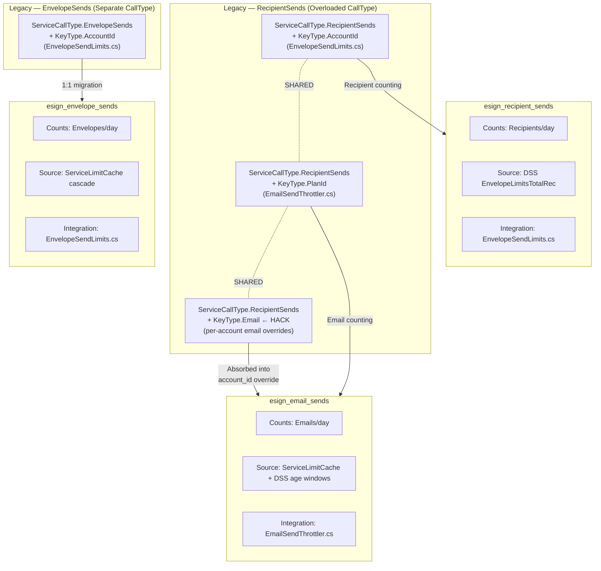
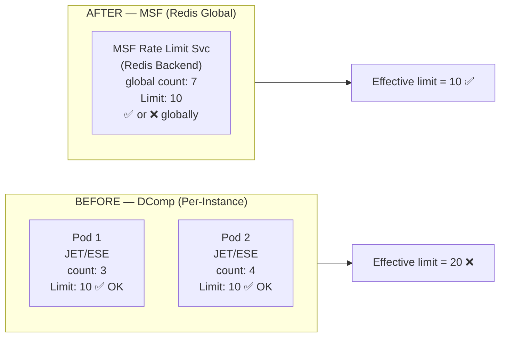
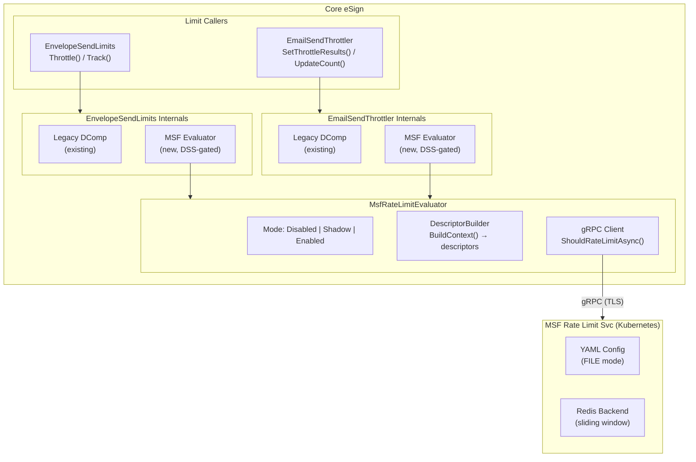
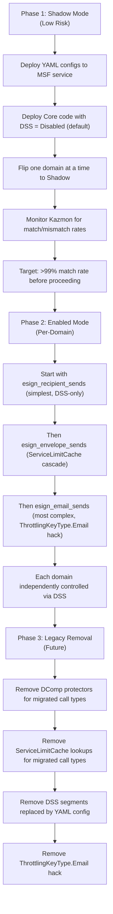
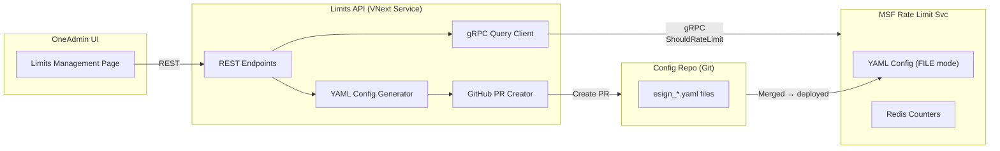
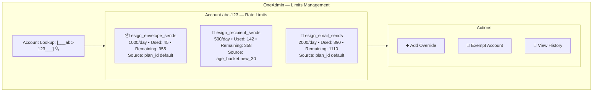

# MSF Global Rate Limit Integration — Design Document

**Author:** Akash Gupta  
**Date:** February 10, 2026  
**Status:** POC Implementation Complete  

---

## 1. Executive Summary

This document describes the design for migrating Core eSign rate limiting from the legacy DComp/JET/ESE per-instance counters to the MSF Global Rate Limit service. The key architectural decision is to use **MSF as-is** — no fork, no new database, no new Limits API, no new rules engine. The MSF descriptor engine already provides the declarative rules matching needed to replace DSS segmentation, ServiceLimitCache cascades, and per-account overrides.

The migration is DSS-gated with three modes (Disabled → Shadow → Enabled) so the legacy system continues to work exactly as before until we validate parity in production.

---

## 2. Legacy Pain Points

### 2.1 DComp/JET/ESE — Per-Instance Counters (Not Global)

| Pain Point | Impact |
|---|---|
| **Windows-only** embedded database (JET/ESE) | Cannot run in Linux containers in Azure |
| **Per-instance counters** — not shared across pods | A 1000/day limit on 10 pods = effectively 10,000/day |
| **No cloud path** — JET/ESE is a Windows kernel component | Blocks Azure migration entirely |
| **Bucket-based sliding window** — complex, fragile | Hard to debug, inconsistent edge behavior |

### 2.2 DSS Segmentation — Configuration Sprawl

| Pain Point | Impact |
|---|---|
| **Regex-based matching** in DSS segments | `\\b([0-6])\\b` for age matching is fragile and unreadable |
| **Sequence-ordered evaluation** (first match wins) | Adding a new segment requires understanding all existing sequences |
| **No dry-run / shadow mode** | Changing a DSS value is a production deployment with no safety net |
| **Scattered across multiple DSS keys** | `EnvelopeLimitsTotalRecipients`, `EnvelopeLimitsTotalRecipientsSmallWindow`, `EnvelopeSendLimitsSmallWindowMode`, etc. |
| **No audit trail** for limit changes | DSS changes are not version-controlled |

### 2.3 ServiceLimitCache — Multi-Layer Cascade

| Pain Point | Impact |
|---|---|
| **4-level cascade** per call type | AccountId → PlanId → DistributorCode → ServiceLimitDefaults |
| **Spread across code and database** | Some limits in code (`ServiceLimitDefaults.cs`, 1,951 lines), some in SQL (`Account Admin → Service Limits`) |
| **ThrottlingKeyType overloading** | `RecipientSends` + `ThrottlingKeyType.Email` is a hack for per-account email overrides because `AccountId` is already taken by EnvelopeSendLimits |
| **No centralized view** | To understand an account's effective limit, you must trace through DSS → ServiceLimitCache → ServiceLimitDefaults → code |

### 2.4 ServiceCallType Overloading

| Pain Point | Impact |
|---|---|
| `ServiceCallType.RecipientSends` shared by **two different systems** | `EnvelopeSendLimits` (counts recipients at envelope creation) AND `EmailSendThrottler` (counts email notifications at dispatch) |
| Different KeyTypes on the same CallType | EnvelopeSendLimits uses `AccountId`, EmailSendThrottler uses `PlanId` |
| Counter collision risk | Both systems write to the same DComp call type but with different semantics |

---

## 3. Architecture Decision: MSF As-Is

### 3.1 Options Evaluated

| Option | Verdict | Reason |
|---|---|---|
| Build new Limits.API + Rules DB | ❌ Rejected | Over-engineering; building what MSF already has |
| Fork MSF and add custom logic | ❌ Rejected | Maintenance burden, diverges from platform team |
| Enhance ServiceLimits (Praveen's proposal) | ❌ Rejected | Service Protection team rejected; doesn't solve DComp |
| **MSF as-is with descriptor engine** | ✅ **Selected** | Zero new infrastructure. Descriptor engine IS a declarative rules engine |

### 3.2 Why MSF Descriptor Engine Is Sufficient

The MSF ratelimit service (based on Envoy's `envoy-ratelimit`, forked at `github.docusignhq.com/Microservices/ratelimit`) provides:

| Capability | MSF Feature | Replaces Legacy |
|---|---|---|
| **Nested matching** | Descriptors can be nested N levels deep | DSS sequence-ordered segments |
| **Most-specific-match** | Inner descriptors override outer ones | ServiceLimitCache cascade |
| **Wildcards** | Omitting `value:` on a key matches any value | DSS regex patterns |
| **`replaces`** | Named rate limits can be overridden by more specific rules | Per-account ServiceLimit overrides |
| **`unlimited: true`** | Exempts specific entities from limits | SecOps Trusted multiplier, ExcludeByAccountId |
| **`shadow_mode: true`** | Logs but doesn't enforce | No legacy equivalent (DSS changes are live) |
| **Sliding window** | `sliding_cache_impl.go` in internal fork | Matches DComp's rolling window behavior |
| **Global counters** | Redis-backed, shared across all pods | Eliminates DComp per-instance problem |

### 3.3 What This Means

- **No new service** to build, deploy, or operate
- **No new database** — MSF uses Azure Cache for Redis (already provisioned)
- **No new rules engine** — MSF's descriptor matching IS the rules engine
- **Config-as-code** — YAML files version-controlled alongside the service code
- **The restraint in not over-engineering is the principal-level signal**

---

## 4. Domain Design

Three MSF domains replace the legacy rate limiting. `ServiceCallType.EnvelopeSends` maps directly to its own domain (`esign_envelope_sends`). The overloading of `ServiceCallType.RecipientSends` — shared by both `EnvelopeSendLimits` (recipient counting) and `EmailSendThrottler` (email counting) — is resolved by splitting into two separate domains (`esign_recipient_sends` and `esign_email_sends`):



### 4.1 Domain: esign_envelope_sends

| Aspect | Value |
|---|---|
| **Counts** | Number of envelopes sent per account |
| **Legacy source** | `ServiceLimitCache`: AccountId → PlanId → DistributorCode cascade |
| **Descriptors** | `plan_id`, `distributor_code`, `account_id`, `secops_status` |
| **Integration point** | `EnvelopeSendLimits.InvokeComputationService()` |

### 4.2 Domain: esign_recipient_sends

| Aspect | Value |
|---|---|
| **Counts** | Cumulative recipients across all envelopes per account |
| **Legacy source** | DSS `EnvelopeLimitsTotalRecipients` with age/plan segmentation |
| **Descriptors** | `account_id`, `plan_type`, `plan_id`, `age_bucket`, `secops_status` |
| **Integration point** | `EnvelopeSendLimits.AddRecipientLimitProtectors()` (evaluated via MSF alongside) |

#### DSS Segment → MSF Descriptor Mapping

| DSS Segment | Seq | DSS Value | MSF Descriptor | MSF Limit |
|---|---|---|---|---|
| Default | — | `5000,Enabled` | `account_id` (wildcard) | `5000/day` |
| 7DaysFree | 20 | `25,Enabled` | `plan_type: free` + `age_bucket: new_0` | `25/day` |
| OlderThan7DaysFree | 30 | `50,Enabled` | `plan_type: free` + `age_bucket` (wildcard) | `50/day` |
| Paygo | 35 | `50,Enabled` | `plan_id: ea3dd9...` | `50/day` |
| 7DaysPaid | 40 | `250,Enabled` | `age_bucket: new_0` | `250/day` |
| 30DaysPaid | 50 | `500,Enabled` | `age_bucket: new_30` | `500/day` |
| ExcludeByAccountId | 1 | `300,Disabled` | `account_id: <guid>` | `unlimited: true` |
| ResetAgeLimitsByAccountId | 2 | `5000,Enabled` | `account_id: <guid>` replaces | `5000/day` |
| Fidelity_Exempt | 10 | `300,Disabled` | `plan_id: 9148e0...` | `unlimited: true` |
| SecOps Trusted | code | × 3 multiplier | `secops_status: trusted` | `unlimited: true` |

### 4.3 Domain: esign_email_sends

| Aspect | Value |
|---|---|
| **Counts** | Email notifications dispatched per plan/account |
| **Legacy source** | `ServiceLimitCache` with `ThrottlingKeyType.Email` hack for per-account overrides |
| **Descriptors** | `plan_id`, `age_bucket`, `distributor_code`, `account_id`, `secops_status` |
| **Integration point** | `EmailSendThrottler.SetThrottleResults()` |

---

## 5. How Pain Points Are Addressed

### 5.1 DComp/JET/ESE → Redis (Global Counters)



- **Global accuracy**: All pods share the same Redis counter
- **Cloud-native**: No Windows dependency, runs anywhere
- **Sliding window**: Internal fork has `sliding_cache_impl.go`, matches DComp behavior

### 5.2 DSS Regex Segments → Declarative YAML Descriptors

```
BEFORE (DSS):                        AFTER (MSF YAML):
{                                     - key: plan_type
  "name": "7DaysFree",                 value: free
  "sequence": 20,                      descriptors:
  "conditions": [                        - key: age_bucket
    {                                      value: new_0
      "operator": "RegExp",                rate_limit:
      "context": "PlanName",                 requests_per_unit: 25
      "value": "free|trial|chrome"
    },
    {
      "operator": "RegExp",
      "context": "AccountAge",
      "value": "\\b([0-6])\\b"      ← fragile regex
    }
  ]
}
```

- **Readable**: YAML with nested keys instead of regex
- **Version-controlled**: YAML files in the repo, reviewed in PRs
- **Shadow mode**: Test new rules in production without enforcement
- **No sequence ordering**: Descriptor matching uses most-specific-match, not sequence-first-wins

### 5.3 ServiceLimitCache 4-Level Cascade → MSF `replaces`

```
BEFORE (Code):                         AFTER (MSF YAML):
// AccountId?                          - key: plan_id          # default
if (TryGet(AccountId)) → use it          rate_limit:
// PlanId?                                 name: envelope_send_limit
else if (TryGet(PlanId)) → use it          requests_per_unit: 1000
// DistributorCode?
else if (TryGet(DistCode)) → use it    - key: account_id       # override
// ServiceLimitDefaults?                   value: "specific-guid"
else → use hardcoded default               rate_limit:
                                             replaces:
4 levels of if/else in C# code               - name: envelope_send_limit
                                             requests_per_unit: 5000
```

- **Declarative**: Override rules defined in YAML, not scattered across C# classes
- **Self-documenting**: `replaces` explicitly states which rule is being overridden
- **Auditable**: Every change is a YAML diff in a PR

### 5.4 ServiceCallType.RecipientSends Overloading → Separate Domains

```
BEFORE:                                  AFTER:
ServiceCallType.RecipientSends           esign_recipient_sends
  + ThrottlingKeyType.AccountId            → counts recipients at creation
  (EnvelopeSendLimits)                     → keyed by account_id
  
ServiceCallType.RecipientSends           esign_email_sends
  + ThrottlingKeyType.PlanId               → counts emails at dispatch
  (EmailSendThrottler)                     → keyed by plan_id
  
  + ThrottlingKeyType.Email ← HACK       account_id override in YAML
  (per-account email overrides)            → clean, no hack needed
```

- **Clean separation**: Each concern has its own domain, its own descriptors, its own counters
- **No more ThrottlingKeyType.Email hack**: Per-account overrides use `account_id` descriptor with `replaces`
- **Independent scaling**: Can change email limits without affecting recipient limits

### 5.5 No Centralized View → Single YAML Per Domain

```
BEFORE: "What is account X's effective recipient limit?"
  1. Check DSS EnvelopeLimitsTotalRecipients segments (8 segments, regex conditions)
  2. Check ServiceLimitCache for AccountId override
  3. Check ServiceLimitCache for PlanId override
  4. Check ServiceLimitCache for DistributorCode override
  5. Check ServiceLimitDefaults.cs hardcoded values
  6. Check if SecOps Trusted → multiply by 3
  → Answer requires reading 6 sources across 4 systems

AFTER: "What is account X's effective recipient limit?"
  → Read esign_recipient_sends.yaml
  → Descriptor matching gives you the answer in one file
```

---

## 6. Integration Architecture

### 6.1 Component Diagram



### 6.2 DSS Settings

| Setting | Type | Default | Purpose |
|---|---|---|---|
| `EnableMsfRateLimitIntegration` | bool | `false` | Master kill switch |
| `MsfRateLimitServiceAddress` | string | `""` | gRPC endpoint (e.g., `services.dev.docusign.net:443`) |
| `MsfRateLimitTimeoutMs` | int | `100` | gRPC call deadline |
| `MsfRateLimitEnvelopeSendsMode` | string | `Disabled` | `Disabled` / `Shadow` / `Enabled` |
| `MsfRateLimitRecipientSendsMode` | string | `Disabled` | `Disabled` / `Shadow` / `Enabled` |
| `MsfRateLimitEmailSendsMode` | string | `Disabled` | `Disabled` / `Shadow` / `Enabled` |

### 6.3 Three Modes

| Mode | Legacy Runs | MSF Runs | MSF Enforces | Kazmon Logs |
|---|---|---|---|---|
| **Disabled** | ✅ | ❌ | ❌ | None |
| **Shadow** | ✅ | ✅ | ❌ | Match/mismatch comparison |
| **Enabled** | ✅ (results compared) | ✅ | ✅ | Decision source, overrides |

### 6.4 Shadow Mode Decision Matrix

| Legacy Says | MSF Says | Shadow Mode | Enabled Mode |
|---|---|---|---|
| OK | OK | ✅ Log match | ✅ Allow |
| OK | OVER_LIMIT | ⚠️ Log mismatch | ❌ **Block** (MSF enforces) |
| OVER_LIMIT | OK | ⚠️ Log mismatch | ✅ **Allow** (MSF overrides) |
| OVER_LIMIT | OVER_LIMIT | ✅ Log match | ❌ Block |

### 6.5 Fail-Open Strategy

Every failure path returns OK to avoid blocking production traffic:

- gRPC connection timeout → OK
- gRPC RpcException → OK
- Unexpected C# exception → OK
- MSF service unavailable → OK
- `EnableMsfRateLimitIntegration` = false → short-circuit, no call

---

## 7. Validation

### 7.1 INT Environment gRPC Test

```
$ grpcurl -vv -insecure \
  -import-path .../protos/docusign/ratelimit/v1/ \
  -proto ratelimitservice.proto \
  -d '{"domain":"esign_recipient_sends", 
       "descriptors":{"entries":[{"key":"account_id","value":"test-123"}]}}' \
  services.dev.docusign.net:443 \
  docusign.ratelimit.v1.RateLimitService.ShouldRateLimit

Response: { "overallCode": "CODE_OK", "statuses": [{ "code": "CODE_OK" }] }
Timing: ~70ms RPC, ~300ms with TLS handshake
```

**Result**: Endpoint reachable, proto contract confirmed, domain not yet configured (returns OK by default — safe).

### 7.2 Pending Validation Steps

1. Deploy YAML config to MSF service in INT
2. Repeat grpcurl test — should see `limit_remaining` and `current_limit` in response
3. Rapid-fire to trigger `CODE_OVER_LIMIT`
4. Deploy Core POC code to INT with Shadow mode DSS
5. Monitor Kazmon for match/mismatch rates between legacy and MSF
6. Validate sliding window alignment (DComp vs MSF Redis)
7. Validate per-account overrides (`replaces`) work as expected

---

## 8. Files Created / Modified

### New Files (POC)

| File | Purpose |
|---|---|
| `ApiLimits.Abstractions/IMsfRateLimitClient.cs` | Interface + response/descriptor models |
| `ApiLimits.Abstractions/IMsfRateLimitDescriptorBuilder.cs` | Interface + MsfRateLimitContext model |
| `ApiLimits.Abstractions/IMsfRateLimitEvaluator.cs` | Orchestrator interface + evaluation result |
| `ApiLimits/MsfRateLimitClient.cs` | gRPC client (raw protobuf, POC) |
| `ApiLimits/MsfRateLimitDescriptorBuilder.cs` | Builds descriptors for 3 domains |
| `ApiLimits/MsfRateLimitEvaluator.cs` | Shadow/Enabled mode orchestration |
| `ApiLimits/DynamicSystemSettings.MsfRateLimit.cs` | 6 DSS settings |
| `ApiLimits/MsfRateLimitConfig/esign_envelope_sends.yaml` | Envelope sends YAML config |
| `ApiLimits/MsfRateLimitConfig/esign_recipient_sends.yaml` | Recipient sends YAML config |
| `ApiLimits/MsfRateLimitConfig/esign_email_sends.yaml` | Email sends YAML config |
| `ApiLimits.UnitTests/MsfRateLimitDescriptorBuilderTests.cs` | 16 unit tests |
| `ApiLimits.UnitTests/MsfRateLimitEvaluatorTests.cs` | 11 unit tests |

### Modified Files

| File | Change |
|---|---|
| `EnvelopeSendLimits.cs` | Added `IMsfRateLimitEvaluator`, shadow/enabled mode alongside legacy |
| `EmailSendThrottler.cs` | Added `IMsfRateLimitEvaluator`, MSF evaluation in `SetThrottleResults()` |
| `ApiLimitsBootstrapper.cs` | Registered MSF services in Unity DI |
| `BusinessObjects.ApiLimits.csproj` | Added `Grpc.Net.Client` + `Google.Protobuf` packages |

---

## 9. Rollout Plan



---

## 10. Limits API for OneAdmin UI

OneAdmin currently has no centralized view for managing rate limits — admins must manually edit DSS segments, ServiceLimitCache entries, and SecOps trust flags across multiple systems. A thin Limits API provides a unified, auditable interface for OneAdmin to query and manage MSF-backed limits.

### 10.1 Architecture



### 10.2 Read Endpoints (Query Current State)

These endpoints query the MSF service in real-time and/or read the YAML config to show effective limits.

#### `GET /api/v1/limits/{domain}/accounts/{accountId}`

Returns the effective limit and current usage for an account in a given domain.

```json
// GET /api/v1/limits/esign_recipient_sends/accounts/abc-123-def
{
    "domain": "esign_recipient_sends",
    "accountId": "abc-123-def",
    "effectiveLimit": {
        "requestsPerUnit": 500,
        "unit": "DAY",
        "source": "age_bucket:new_30",
        "isUnlimited": false
    },
    "currentUsage": {
        "count": 142,
        "remaining": 358,
        "resetAt": "2026-02-11T00:00:00Z"
    },
    "descriptorsMatched": {
        "account_id": "abc-123-def",
        "plan_type": "paid",
        "age_bucket": "new_30",
        "secops_status": "normal"
    },
    "overrides": [],
    "legacyComparison": {
        "legacyLimit": 500,
        "legacySource": "DSS:30DaysPaid",
        "isAligned": true
    }
}
```

#### `GET /api/v1/limits/{domain}/config`

Returns the full YAML config for a domain in structured JSON.

```json
// GET /api/v1/limits/esign_recipient_sends/config
{
    "domain": "esign_recipient_sends",
    "defaultLimit": { "requestsPerUnit": 5000, "unit": "DAY" },
    "rules": [
        {
            "descriptors": { "plan_type": "free", "age_bucket": "new_0" },
            "limit": { "requestsPerUnit": 25, "unit": "DAY" },
            "note": "7DaysFree"
        },
        {
            "descriptors": { "plan_type": "free" },
            "limit": { "requestsPerUnit": 50, "unit": "DAY" },
            "note": "OlderThan7DaysFree"
        }
    ],
    "accountOverrides": [
        {
            "accountId": "specific-guid",
            "limit": { "requestsPerUnit": 5000, "unit": "DAY" },
            "replaces": "recipient_send_limit",
            "note": "ResetAgeLimitsByAccountId"
        }
    ],
    "exemptions": [
        {
            "type": "account",
            "id": "exempt-guid",
            "reason": "ExcludeByAccountId"
        },
        {
            "type": "plan",
            "id": "9148e0...",
            "reason": "Fidelity_Exempt"
        }
    ]
}
```

#### `GET /api/v1/limits/{domain}/accounts/{accountId}/history`

Returns recent rate-limit decisions for an account (sourced from Kazmon/telemetry).

```json
// GET /api/v1/limits/esign_recipient_sends/accounts/abc-123/history?hours=24
{
    "domain": "esign_recipient_sends",
    "accountId": "abc-123",
    "period": "24h",
    "decisions": [
        {
            "timestamp": "2026-02-10T14:22:31Z",
            "code": "CODE_OK",
            "currentCount": 142,
            "limit": 500,
            "hitsAddend": 5
        },
        {
            "timestamp": "2026-02-10T15:01:12Z",
            "code": "CODE_OVER_LIMIT",
            "currentCount": 501,
            "limit": 500,
            "hitsAddend": 3
        }
    ]
}
```

### 10.3 Write Endpoints (Manage Overrides)

Write operations generate YAML changes and submit them as PRs to the config repo. This preserves auditability — every change is a git commit reviewed by engineering.

#### `POST /api/v1/limits/{domain}/overrides/account`

Creates a per-account override (maps to a `replaces` entry in YAML).

```json
// POST /api/v1/limits/esign_recipient_sends/overrides/account
{
    "accountId": "abc-123-def",
    "requestsPerUnit": 10000,
    "unit": "DAY",
    "reason": "JIRA-12345: Enterprise customer temporary increase",
    "expiresAt": "2026-06-01T00:00:00Z"
}

// Response:
{
    "status": "pending_approval",
    "pullRequestUrl": "https://github.docusignhq.com/Microservices/ratelimit/pull/42",
    "yamlChange": {
        "file": "esign_recipient_sends.yaml",
        "diff": "+ - key: account_id\n+   value: abc-123-def\n+   rate_limit:\n+     replaces: [{name: recipient_send_limit}]\n+     requests_per_unit: 10000\n+     unit: DAY"
    }
}
```

#### `POST /api/v1/limits/{domain}/exemptions/account`

Exempts an account from limits (maps to `unlimited: true` in YAML).

```json
// POST /api/v1/limits/esign_recipient_sends/exemptions/account
{
    "accountId": "exempt-guid",
    "reason": "JIRA-12346: Internal test account",
    "expiresAt": null
}

// Response:
{
    "status": "pending_approval",
    "pullRequestUrl": "https://github.docusignhq.com/Microservices/ratelimit/pull/43"
}
```

#### `DELETE /api/v1/limits/{domain}/overrides/account/{accountId}`

Removes a per-account override (deletes the `replaces` block from YAML).

```json
// DELETE /api/v1/limits/esign_recipient_sends/overrides/account/abc-123-def
{
    "reason": "JIRA-12345: Temporary increase expired"
}

// Response:
{
    "status": "pending_approval",
    "pullRequestUrl": "https://github.docusignhq.com/Microservices/ratelimit/pull/44"
}
```

#### `PUT /api/v1/limits/{domain}/config/rules`

Updates a domain's default or tiered limits (modifies the top-level descriptors in YAML). Restricted to platform admins.

```json
// PUT /api/v1/limits/esign_recipient_sends/config/rules
{
    "changes": [
        {
            "descriptors": { "plan_type": "free", "age_bucket": "new_0" },
            "requestsPerUnit": 30,
            "reason": "Increasing free 7-day limit from 25 to 30"
        }
    ]
}

// Response:
{
    "status": "pending_approval",
    "pullRequestUrl": "https://github.docusignhq.com/Microservices/ratelimit/pull/45",
    "impactAnalysis": {
        "affectedAccountsEstimate": 12400,
        "currentValue": 25,
        "newValue": 30
    }
}
```

### 10.4 Bulk / Search Endpoints

#### `GET /api/v1/limits/{domain}/overrides`

Lists all per-account overrides for a domain.

```json
// GET /api/v1/limits/esign_recipient_sends/overrides?page=1&pageSize=50
{
    "domain": "esign_recipient_sends",
    "totalOverrides": 23,
    "items": [
        {
            "accountId": "abc-123-def",
            "requestsPerUnit": 10000,
            "unit": "DAY",
            "expiresAt": "2026-06-01T00:00:00Z",
            "reason": "JIRA-12345",
            "createdAt": "2026-02-10T10:00:00Z"
        }
    ]
}
```

#### `GET /api/v1/limits/accounts/{accountId}`

Returns effective limits for an account across ALL domains.

```json
// GET /api/v1/limits/accounts/abc-123-def
{
    "accountId": "abc-123-def",
    "domains": [
        {
            "domain": "esign_envelope_sends",
            "effectiveLimit": 1000,
            "currentUsage": 45,
            "source": "plan_id default"
        },
        {
            "domain": "esign_recipient_sends",
            "effectiveLimit": 500,
            "currentUsage": 142,
            "source": "age_bucket:new_30"
        },
        {
            "domain": "esign_email_sends",
            "effectiveLimit": 2000,
            "currentUsage": 890,
            "source": "plan_id default"
        }
    ]
}
```

### 10.5 Design Considerations

| Consideration | Decision | Rationale |
|---|---|---|
| **Write model** | PR-based (GitOps) | Every change is auditable, reviewable, revertible. No direct YAML mutation. |
| **Read model** | Live gRPC + YAML parse | Real-time usage from MSF, config from parsed YAML |
| **Auth** | OneAdmin SSO + RBAC | Read: any admin. Write overrides: tier-2+. Write rules: platform admins only. |
| **Expiry** | TTL field on overrides | Scheduled job removes expired overrides via PR. Prevents permanent one-off hacks. |
| **Propagation delay** | ~30s after PR merge | FILE mode YAML reload interval. UI shows "pending propagation" status. |
| **Blast radius** | Rule changes show impact estimate | `impactAnalysis` in PUT response gives estimated affected accounts. |

### 10.6 OneAdmin UI Wireframe Concept



---

## 11. Risk Mitigation

| Risk | Mitigation |
|---|---|
| MSF service downtime | Fail-open: gRPC errors return OK |
| Redis latency spike | 100ms timeout (DSS configurable), fail-open |
| Sliding vs fixed window drift | Internal fork has `sliding_cache_impl.go` — confirm active |
| YAML config error | Shadow mode catches mismatches before enforcement |
| Per-instance → global counter migration | Global limits are actually tighter — accounts that exploited per-instance splitting will now be correctly limited |
| Regression in any call type | Each domain has independent DSS toggle — can disable one without affecting others |
| Raw protobuf POC client | Replace with typed client from `DocuSign.Protobuf.DocuSign.Ratelimit.V1` NuGet before production |
