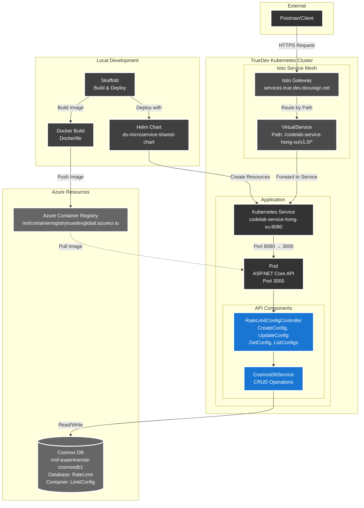
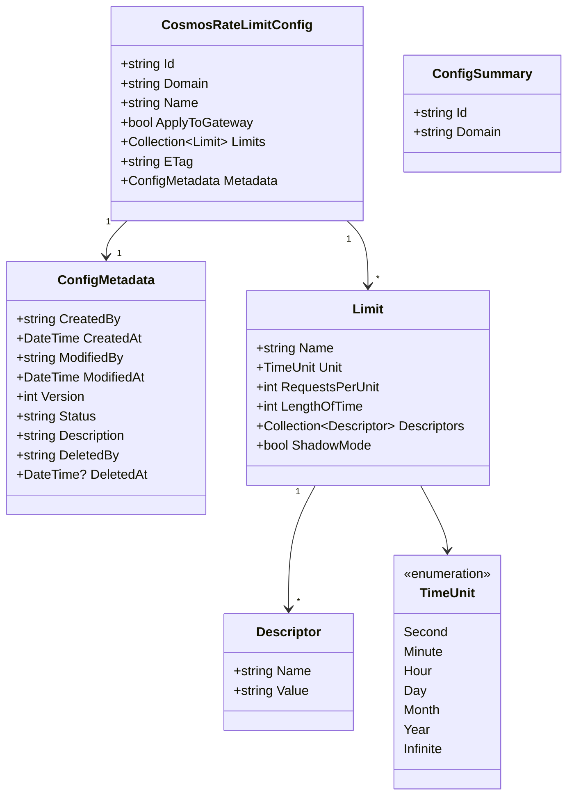

# Codelab API

A Rate Limit Configuration API built with ASP.NET Core for managing rate limit configurations in Cosmos DB.

## Architecture Overview



**Technology Stack:**
- **Framework**: .NET 8.0
- **Port**: 3000 (container), 8080 (service)
- **Namespace**: codelab
- **Deployment**: Kubernetes with Skaffold + Helm
- **Service Mesh**: Istio VirtualService routing
- **Database**: Azure Cosmos DB

---

## Data Models

The application uses the following data models for rate limit configuration management:



**Key Models:**
- **CosmosRateLimitConfig**: Main document stored in Cosmos DB, contains all rate limit configuration data
- **ConfigMetadata**: Tracks configuration lifecycle (creation, modification, version, status)
- **Limit**: Defines a specific rate limit rule with time unit and request threshold
- **Descriptor**: Key-value pairs used for matching requests to specific limits
- **ConfigSummary**: Lightweight model for listing configurations (id and domain only)

---

## Web API

**Base URL:** `https://services.true.dev.docusign.net/codelab-service-{username}/v1.0/`

*(Replace `{username}` with your username, dots replaced with dashes. Example: `hong.xu` → `codelab-service-hong-xu`)*

### API Endpoints Overview

| Method | Endpoint | Description |
|--------|----------|-------------|
| GET | `/health` | Check the health status of the service |
| GET | `/api/RateLimitConfig` | List all rate limit configurations (id and domain only) |
| GET | `/api/RateLimitConfig/id/{id}/domain/{domain}` | Get a specific rate limit configuration by ID and domain |
| POST | `/api/RateLimitConfig` | Create a new rate limit configuration |
| PUT | `/api/RateLimitConfig` | Update an existing rate limit configuration |

---

### Health Check

**GET** `/health`

Returns the health status of the service.

**Example:**
```bash
curl https://services.true.dev.docusign.net/codelab-service-hong-xu/v1.0/health
```

**Response:**
```json
{
  "status": "healthy",
  "timestamp": "2026-02-15T07:54:41.4976978Z"
}
```

---

### List All Configurations

**GET** `/api/RateLimitConfig`

Lists all rate limit configurations (returns only id and domain, without config details).

**Example:**
```bash
curl "https://services.true.dev.docusign.net/codelab-service-hong-xu/v1.0/api/RateLimitConfig"
```

**Response (200 OK):**
```json
{
  "count": 2,
  "configs": [
    {
      "id": "api-rate-limit-001",
      "domain": "example-service"
    },
    {
      "id": "api-rate-limit-002",
      "domain": "another-service"
    }
  ]
}
```

---

### Get Rate Limit Configuration

**GET** `/api/RateLimitConfig/id/{id}/domain/{domain}`

Retrieves a rate limit configuration by ID and domain.

**Parameters:**
- `id` (path parameter): The configuration ID
- `domain` (path parameter): The domain name

**Example:**
```bash
curl "https://services.true.dev.docusign.net/codelab-service-hong-xu/v1.0/api/RateLimitConfig/id/api-rate-limit-001/domain/example-service"
```

**Response (200 OK):** Full configuration object

**Error Responses:**
- `404 Not Found` - Configuration not found

---

### Create Rate Limit Configuration

**POST** `/api/RateLimitConfig`

Creates a new rate limit configuration in Cosmos DB.

**Request Body Example:**
```json
{
  "id": "api-rate-limit-001",
  "domain": "example-service",
  "name": "api-rate-limit-001",
  "applyToGateway": false,
  "limits": [
    {
      "name": "limit-by-user",
      "unit": "Minute",
      "requestsPerUnit": 100,
      "lengthOfTime": 1,
      "shadowMode": false,
      "descriptors": [
        {
          "name": "user_id",
          "value": ""
        }
      ]
    }
  ],
  "metadata": {
    "createdBy": "user@example.com",
    "status": "active",
    "description": "Rate limit configuration for API endpoints"
  }
}
```

**Response (201 Created):**
```json
{
  "id": "api-rate-limit-001",
  "domain": "example-service",
  "name": "api-rate-limit-001",
  "status": "active",
  "version": 1,
  "timestamp": "2026-02-15T08:00:00.0000000Z",
  "message": "Configuration created successfully"
}
```

**Error Responses:**
- `400 Bad Request` - Missing required fields (id, domain, name)
- `409 Conflict` - Configuration with the same ID already exists in the domain

---

### Update Rate Limit Configuration

**PUT** `/api/RateLimitConfig`

Updates an existing rate limit configuration in Cosmos DB.

**Request Body:** JSON payload with updated rate limit configuration

**Response (200 OK):**
```json
{
  "id": "api-rate-limit-001",
  "domain": "example-service",
  "name": "api-rate-limit-001",
  "status": "active",
  "version": 2,
  "timestamp": "2026-02-15T08:00:00.0000000Z",
  "message": "Configuration updated successfully"
}
```

**Error Responses:**
- `400 Bad Request` - Missing required fields (id, domain, name)
- `404 Not Found` - Configuration not found in the specified domain
- `409 Conflict` - ETag mismatch (configuration was modified by another process)

---

### Testing with Postman

**List All Configurations (GET):**
1. **Method**: `GET`
2. **URL**: `https://services.true.dev.docusign.net/codelab-service-{username}/v1.0/api/RateLimitConfig`
3. **Send**: Should receive `200 OK` with list of id and domain pairs

**Get Configuration (GET):**
1. **Method**: `GET`
2. **URL**: `https://services.true.dev.docusign.net/codelab-service-{username}/v1.0/api/RateLimitConfig/id/{id}/domain/{domain}`
3. **Send**: Should receive `200 OK` with full configuration

**Create Configuration (POST):**
1. **Method**: `POST`
2. **URL**: `https://services.true.dev.docusign.net/codelab-service-{username}/v1.0/api/RateLimitConfig`
3. **Headers**: `Content-Type: application/json`
4. **Body**: Select "raw" + "JSON", example:
   ```json
   {
     "id": "api-rate-limit-001",
     "domain": "example-service",
     "name": "api-rate-limit-001",
     "applyToGateway": false,
     "limits": [
       {
         "name": "limit-by-user",
         "unit": "Minute",
         "requestsPerUnit": 100,
         "lengthOfTime": 1,
         "shadowMode": false,
         "descriptors": [
           {
             "name": "user_id",
             "value": ""
           }
         ]
       }
     ],
     "metadata": {
       "createdBy": "user@example.com",
       "status": "active",
       "description": "Rate limit configuration for API endpoints"
     }
   }
   ```
5. **Send**: Should receive `201 Created` response

**Update Configuration (PUT):**
1. **Method**: `PUT`
2. **URL**: Same as POST
3. **Headers**: `Content-Type: application/json`
4. **Body**: Modified configuration JSON (must include existing `id` and `domain`)
5. **Send**: Should receive `200 OK` response

---

## Local Development

### Run Locally

```powershell
# Set environment variable for development
$env:ASPNETCORE_ENVIRONMENT = 'Development'

# Run the API
cd src/CodelabApi
dotnet run
```

The API will be available at `http://localhost:3000`

**Note**: Make sure Cosmos DB credentials are configured in `appsettings.Development.json`

---

## Kubernetes Deployment

### Prerequisites

Ensure you have access to Azure Container Registry and Kubernetes cluster:

```powershell
az login
az acr login --name msfcontainerregistrytruedevglobal
kubectl config current-context  # Should show: msf-development-westus3-a
```

### Deploy

From the `codelab1` directory:

```powershell
$env:USER = $env:USERNAME
skaffold run
```

### Remove Deployment

```powershell
helm uninstall codelab-service-hong-xu -n codelab
```

### Verify Deployment

```powershell
kubectl get pods -n codelab -l app=codelab-service-hong-xu
kubectl logs -n codelab -l app=codelab-service-hong-xu --tail=50
```

### Troubleshooting

**"map has no entry for key USER":**
```powershell
$env:USER = $env:USERNAME
```

**ACR authentication error:**
```powershell
az acr login --name msfcontainerregistrytruedevglobal
```

---

## How URL Routing Works

**URL Structure:**
```
https://services.true.dev.docusign.net/codelab-service-hong-xu/v1.0/api/RateLimitConfig/id/{id}/domain/{domain}
                                      └──────────────────────────┘
                                        VirtualService Routing Path
```

**Request Flow:**
1. Request arrives at: `/codelab-service-hong-xu/v1.0/health`
2. VirtualService matches prefix and strips it
3. Routes to Kubernetes service: `codelab-service-hong-xu:8080`
4. Service forwards to pod: `port 3000`
5. Your API receives: `GET /health`

**Key Points:**
- `codelab-service-{username}` = Unique routing path per user (configured in `skaffold.yaml`)
- `v1.0` = API version string
- Multiple users share the same gateway, each with a unique path prefix
- VirtualService handles routing through Istio gateway
