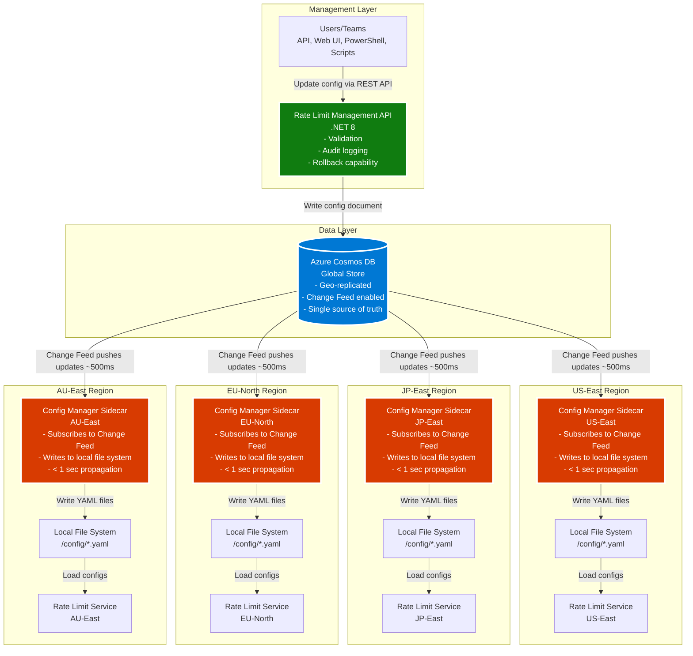
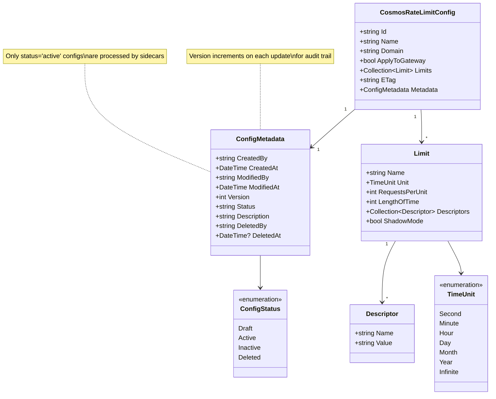
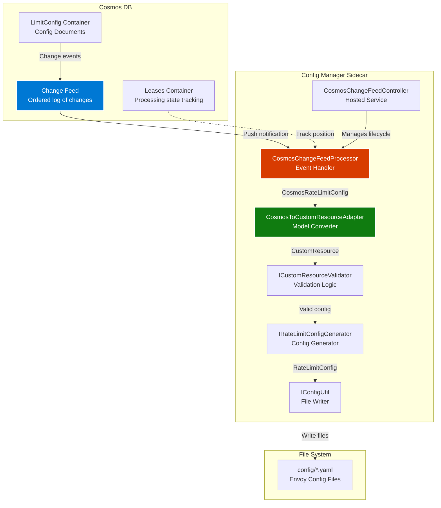

# Global Rate Limit Configuration Management with Cosmos DB Change Feed

## Introduction

This proposal extends the existing config-manager sidecar to watch an external distributed store (Azure Cosmos DB) for runtime configuration changes. Changes synchronize across all regions in real-time (< 1 second) using Cosmos DB Change Feed (push-based, no polling). This enables global rate limit management with low-latency local reads while maintaining a single source of truth.

---

## Architecture Overview

### Global Distributed Architecture



## Key Components

### 1. Rate Limit Management API
**Technology**: ASP.NET Core (.NET 8)

**Responsibilities:**
- Expose REST API for CRUD operations on rate limit configurations
- Validate configuration structure and business rules
- Write/update configuration documents in Cosmos DB
- Provide audit logging and versioning
- Support rollback to previous versions

**Endpoints:**
- `POST /api/RateLimitConfig` - Create new configuration
- `PUT /api/RateLimitConfig` - Update existing configuration
- `GET /api/RateLimitConfig/{id}` - Retrieve configuration
- `GET /api/RateLimitConfig` - List all configurations

### 2. Azure Cosmos DB
**Configuration:**
- **Database**: `RateLimit`
- **Container**: `LimitConfig`
- **Partition Key**: `/domain`
- **Change Feed**: Enabled (push-based)
- **Geo-Replication**: All regions (US-East, JP-East, EU-North, AU-East)
- **Consistency**: Strong consistency for writes, eventual for reads

**Features:**
- Single source of truth for all rate limit configurations
- Global replication with automatic failover
- Change feed provides real-time push notifications
- Optimistic concurrency control via ETag

### 3. Config Manager Sidecar (Enhanced)
**Location**: Deployed in each Kubernetes region as a sidecar container

**New Capabilities:**
- **CosmosChangeFeedController**: Hosted service managing change feed processor lifecycle
- **CosmosChangeFeedProcessor**: Processes Cosmos DB change feed events
- **CosmosToCustomResourceAdapter**: Converts Cosmos models to internal CustomResource format

**Processing Logic:**
1. Subscribe to Cosmos DB Change Feed
2. Receive push notifications for document changes (~500ms latency)
3. Filter by `status: "active"` (ignore draft/inactive/deleted configs)
4. Validate configuration using existing `ICustomResourceValidator`
5. Generate Envoy-compatible format using existing `IRateLimitConfigGenerator`
6. Write YAML files to local file system using existing `IConfigUtil`

**Key Design Decisions:**
- **Adapter Pattern**: Decouple Cosmos schema from internal models
- **Reuse Existing Logic**: Leverage existing validation, generation, and file writing code
- **Lease Management**: Cosmos DB lease container coordinates distributed processing with processor groups and automatic partition distribution

### 4. Envoy Rate Limit Service
**Behavior**: No changes required - continues to load configurations from local file system

---

## Data Models

### Cosmos DB Configuration Model



### Example Configuration Document

```json
{
  "id": "api-rate-limit-001",
  "name": "api-rate-limit-001",
  "domain": "payment-service",
  "applyToGateway": false,
  "limits": [
    {
      "name": "limit-by-user",
      "unit": "Minute",
      "requestsPerUnit": 100,
      "lengthOfTime": 1,
      "shadowMode": false,
      "descriptors": [
        {
          "name": "user_id",
          "value": ""
        }
      ]
    }
  ],
  "metadata": {
    "createdBy": "user@example.com",
    "createdAt": "2026-02-15T08:00:00Z",
    "modifiedBy": "user@example.com",
    "modifiedAt": "2026-02-15T08:00:00Z",
    "version": 1,
    "status": "active",
    "description": "Rate limit for payment API endpoints"
  },
  "_etag": "\"0000d315-0000-0800-0000-65ce56920000\""
}
```

---

## Change Feed Processing Details

### Change Feed Architecture



### Processing Flow

1. **Change Detection**
   - Cosmos DB Change Feed emits events for document inserts/updates/deletes
   - Push-based delivery (~500ms latency from write to notification)
   - Events include full document content and metadata

2. **Filtering**
   - Only process documents where `metadata.status == "active"`
   - Skip `draft`, `inactive`, and `deleted` configurations
   - Ignore changes that don't affect configuration (e.g., metadata-only updates)

3. **Transformation**
   - **CosmosToCustomResourceAdapter** converts Cosmos model to internal `CustomResource` model
   - Preserves all rate limit rules, descriptors, and settings
   - Maps Cosmos metadata to internal metadata structure

4. **Validation**
   - Use existing `ICustomResourceValidator` to ensure configuration correctness
   - Validate required fields, value ranges, and business rules
   - Log validation errors without crashing the processor

5. **Generation**
   - Use existing `IRateLimitConfigGenerator` to create Envoy-compatible configuration
   - Generate YAML format matching Envoy rate limit service expectations

6. **File Writing**
   - Use existing `IConfigUtil` to write YAML files to `/config/*.yaml`
   - Atomic file operations to prevent partial updates
   - Envoy rate limit service detects file changes and reloads automatically

### Lease Management

**Purpose**: Coordinate change feed processing across multiple sidecar instances

**Processor Groups**:
- Defined by `processorName` (e.g., `rateLimitConfigProcessor-{REGION}`)
- Instances with the same processor name form a group and share workload
- Using different REGION environment variables creates separate processor groups (e.g., `rateLimitConfigProcessor-US`, `rateLimitConfigProcessor-EU`)

**Partition Distribution**:
- Each lease represents ownership of one Cosmos DB partition
- Only one instance processes changes from a given partition at any time, preventing duplicate processing
- Cosmos DB SDK automatically distributes partitions across instances in the same processor group

**Regional Independence**:
- Each region processes ALL changes independently when using separate processor names
- Enables region-specific processing and isolation

**Automatic Load Balancing**:
- The SDK redistributes partition leases when instances are added or removed
- Enables seamless scale-up/scale-down with automatic failover
- If a sidecar instance fails, its partitions are reassigned to healthy instances
- Ensures exactly-once processing of change feed events

---

## Benefits and Advantages

### 1. Global Consistency
- **Single Source of Truth**: All rate limit configurations stored in Cosmos DB
- **Automatic Replication**: Changes replicated to all regions by Cosmos DB
- **No Drift**: Eliminates configuration inconsistencies between regions

### 2. Real-Time Propagation
- **Push-Based**: Change feed pushes updates immediately (no polling delay)
- **Low Latency**: Configuration changes propagate in < 1 second
- **Parallel Updates**: All regions receive updates simultaneously

### 3. High Performance
- **Local Reads**: Envoy reads from local file system (no network calls)
- **Zero Latency**: No additional latency during request processing
- **Scalable**: Supports thousands of rate limit configurations

### 4. Operational Excellence
- **UI-Driven**: Manage configurations through web interface
- **Audit Trail**: Track who created/modified/deleted each configuration
- **Versioning**: Roll back to previous configuration versions
- **Status Management**: Use draft/active/inactive/deleted lifecycle

### 5. Developer Experience
- **No CRDs**: Eliminate need for kubectl and Kubernetes CRD knowledge
- **Self-Service**: Teams manage their own rate limit configurations
- **Testing**: Use draft status to test configurations before activation

### 6. Reliability
- **Automatic Failover**: Cosmos DB handles regional failures
- **Resilient**: Sidecar continues serving existing configs if Cosmos DB is unavailable
- **Lease Management**: Ensures exactly-once processing

---

## Implementation Considerations

### Deployment Model

Each Kubernetes pod includes two containers:
1. **Application Container**: Your microservice
2. **Config Manager Sidecar**: Subscribes to Cosmos DB Change Feed and manages local configuration files

### Configuration

**Environment Variables**:
```yaml
- name: COSMOS_ENDPOINT
  value: "https://your-cosmosdb-account.documents.azure.com:443/"
- name: COSMOS_KEY
  valueFrom:
    secretKeyRef:
      name: cosmos-db-secret
      key: primary-key
- name: COSMOS_DATABASE
  value: "RateLimit"
- name: COSMOS_CONTAINER
  value: "LimitConfig"
- name: COSMOS_LEASE_CONTAINER
  value: "Leases"
```

---

## Comparison: Kubernetes CRD vs. Cosmos DB

| Aspect | Kubernetes CRD (Current) | Cosmos DB Change Feed (Proposed) |
|--------|--------------------------|----------------------------------|
| **Configuration Source** | Kubernetes Custom Resources | Azure Cosmos DB documents |
| **Management Interface** | kubectl + YAML files | REST API + Web UI |
| **Global Synchronization** | Manual per-region deployment | Automatic via Cosmos DB replication |
| **Propagation Latency** | Minutes (CI/CD pipeline) | < 1 second (Change Feed) |
| **Developer Experience** | Requires Kubernetes knowledge | Self-service web interface |
| **Versioning** | Git-based | Built-in metadata versioning |
| **Audit Trail** | Git history | Cosmos DB metadata tracking |
| **Lifecycle Management** | Git branches / manual | Status-based (draft/active/deleted) |
| **Multi-Region Consistency** | Manual synchronization | Automatic replication |

---

## Conclusion

This proposal introduces a modern, cloud-native approach to global rate limit configuration management. By leveraging Azure Cosmos DB Change Feed, we achieve real-time synchronization across all regions while maintaining low-latency local reads. The solution provides:

- **Global consistency** with a single source of truth
- **Real-time propagation** in under 1 second
- **High performance** with local file system reads
- **Superior developer experience** with UI-driven management
- **Operational excellence** with audit trails and versioning

The architecture reuses existing validation and configuration generation logic, minimizing implementation risk while providing significant operational benefits.

---

## Next Steps

### Security

**Authentication**:
- Use Azure Managed Identity for Cosmos DB access
- Rotate Cosmos DB keys regularly
- Restrict network access to Cosmos DB

**Authorization**:
- API requires authentication (OAuth/JWT)
- Role-based access control (RBAC) for configuration management
- Audit logging for all configuration changes

### Migration Path

#### Phase 1: Parallel Operation
- Deploy Rate Limit Management API
- Deploy enhanced config-manager sidecars with Cosmos DB Change Feed support
- Keep existing Kubernetes CRD approach operational
- Gradually migrate configurations to Cosmos DB

#### Phase 2: Validation
- Validate configuration consistency between CRD and Cosmos DB sources
- Monitor change feed latency and processing reliability
- Gather feedback from early adopters

#### Phase 3: Full Migration
- Migrate all rate limit configurations to Cosmos DB
- Decommission Kubernetes CRD-based configuration management
- Remove CRD validation and generation code from config-manager

### Implementation Steps

1. **Prototype Development**: Build proof-of-concept with one region
2. **Performance Testing**: Validate change feed latency and throughput
3. **Security Review**: Ensure compliance with security requirements
4. **Documentation**: Create runbooks and troubleshooting guides
5. **Pilot Deployment**: Roll out to one service in one region
6. **Gradual Rollout**: Expand to additional services and regions
7. **Full Migration**: Decommission Kubernetes CRD approach

---

## References

- [Azure Cosmos DB Change Feed Documentation](https://learn.microsoft.com/en-us/azure/cosmos-db/change-feed)
- [Envoy Rate Limit Service](https://github.com/envoyproxy/ratelimit)
- [Kubernetes Sidecar Pattern](https://kubernetes.io/docs/concepts/workloads/pods/#workload-resources-for-managing-pods)
