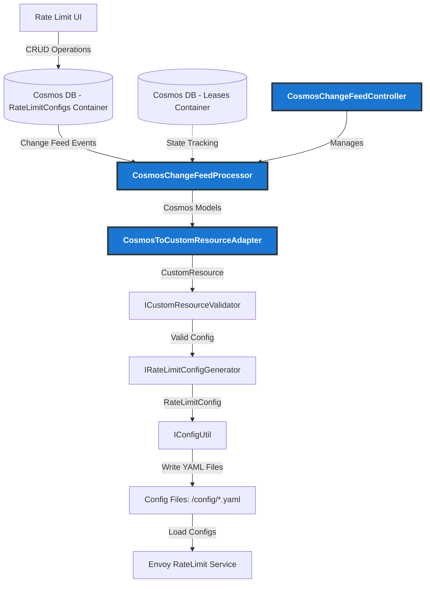
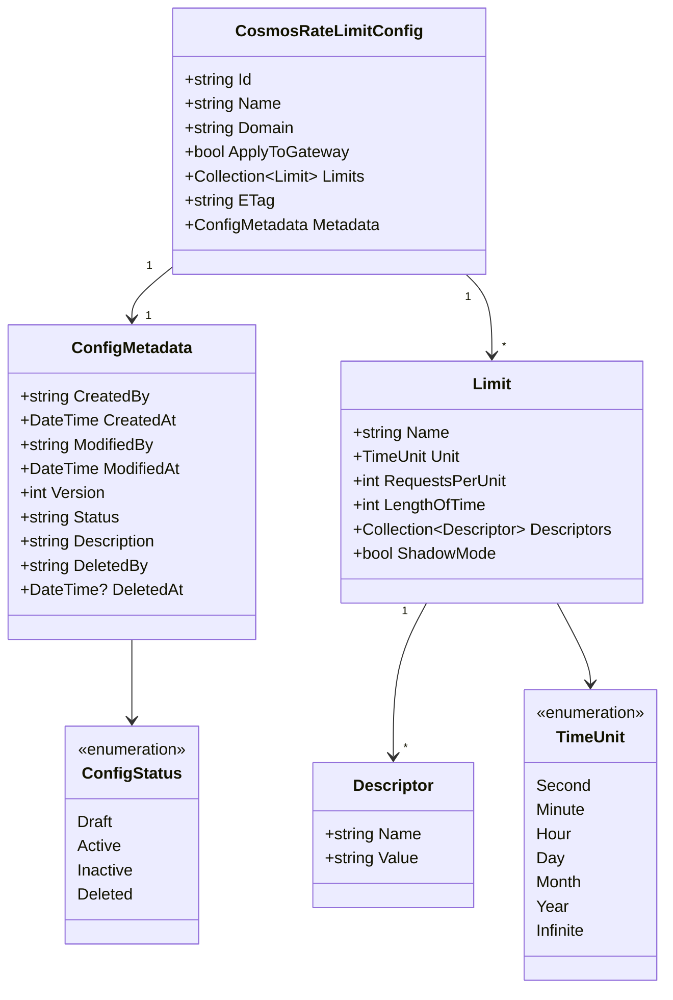

# Config Manager

## Overview

The Config Manager service handles rate limit configuration management from Kubernetes Custom Resource Definitions (CRDs) - the traditional approach.

### New: Cosmos DB Integration
This document explains the idea of using Cosmos DB Change Feed to enable UI-driven rate limit configuration management as an alternative to the existing Kubernetes CRD approach. Users can create, update, and manage rate limit configurations through a web interface. Key features include:
- Real-time change feed processing from Cosmos DB
- Lifecycle management with status-based filtering (draft, active, inactive, deleted)
- Comprehensive metadata tracking for auditing and versioning
- Seamless adapter pattern to reuse existing validation and configuration generation logic

---

## Architecture

### New Cosmos DB Integration Architecture

This new integration introduces two key components registered in the dependency injection container (Startup.cs:59-60):
- **CosmosChangeFeedController**: Registered as a hosted service (background service) that manages the lifecycle of the change feed processor
- **CosmosChangeFeedProcessor**: Registered as a singleton service that processes Cosmos DB change feed events

#### Data Flow

1. **UI → Cosmos DB**: Users create/update rate limit configs through a web UI
2. **Change Feed → Processor**: Cosmos DB Change Feed emits events for document changes
3. **Processor → Adapter**: Changes are converted from Cosmos models to internal CustomResource models
4. **Adapter → Validator**: Existing validation logic ensures config correctness
5. **Validator → Generator**: Valid configs are transformed into Envoy-compatible format
6. **Generator → ConfigUtil**: Configuration files are written to the file system
7. **FileSystem → RateLimitService**: Envoy rate limit service loads the configurations

#### Key Design Patterns

**Adapter Pattern**: **CosmosToCustomResourceAdapter** decouples Cosmos DB schema from internal models, enabling independent evolution.

**Reuse Existing Logic**: The new processor leverages existing validation, generation, and file writing logic to maintain consistency between Kubernetes CRD and Cosmos DB sources.

**Status-Based Processing**: Only configs with `status: "active"` are processed; drafts and inactive configs are ignored.

**Lease Management**: Cosmos DB lease container ensures distributed processing coordination across multiple instances.
- **Processor Groups**: Defined by processorName (e.g., `rateLimitConfigProcessor-{REGION}`). Instances with the same processor name form a group and share workload.
- **Partition Distribution**: Each lease represents ownership of one Cosmos DB partition. Only one instance processes changes from a given partition at any time, preventing duplicate processing.
- **Regional Independence**: Using different REGION environment variables creates separate processor groups (e.g., `rateLimitConfigProcessor-US`, `rateLimitConfigProcessor-EU`), where each region processes ALL changes independently.
- **Automatic Load Balancing**: The SDK redistributes partition leases when instances are added or removed, enabling seamless scale-up/scale-down with automatic failover.

---

## Data Models

### New Cosmos DB Configuration Models

The following data models support the new UI-driven rate limit configuration stored in Cosmos DB:

### Model Descriptions

#### CosmosRateLimitConfig
Main document stored in Cosmos DB representing a rate limit configuration.
- **Id**: Cosmos DB document identifier (matches Name field)
- **Name**: Unique name of the custom resource
- **Domain**: Domain this configuration applies to
- **ApplyToGateway**: Whether config applies to Istio gateway
- **Limits**: Collection of rate limiting rules
- **ETag**: Optimistic concurrency control
- **Metadata**: Lifecycle and auditing information

#### ConfigMetadata
Tracks configuration lifecycle, versioning, and auditing.
- **Status**: Only "active" configs are processed by config-manager
- **Version**: Incremented on each update
- **CreatedBy/ModifiedBy/DeletedBy**: User email for audit trail
- **Timestamps**: Track creation, modification, and deletion times

#### Limit
Defines a specific rate limiting rule.
- **RequestsPerUnit**: Number of requests allowed
- **Unit**: Time granularity (second, minute, hour, etc.)
- **LengthOfTime**: Duration of the rate-limiting window
- **Descriptors**: Key-value pairs for matching requests
- **ShadowMode**: If true, counts requests but doesn't enforce limits

